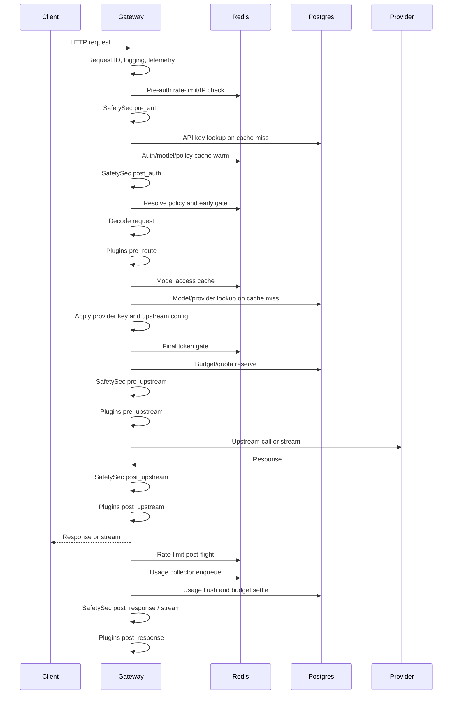

# Gateway Request Lifecycle

All LLM-style endpoints share a common lifecycle implemented by the gateway endpoint handler.

## Middleware Order

The HTTP server wraps the router with:

1. Request ID middleware.
2. Telemetry middleware.
3. Recovery middleware.
4. Logging middleware.

The effective runtime behavior is:

- request ID is read or generated,
- route and stream metadata are attached to context,
- root HTTP span is started,
- request logs are emitted,
- panics are recovered into `500` responses,
- request duration and status are recorded.

## LLM Endpoint Flow

## Important Ordering Details

- Pre-auth rate limiting runs before API key lookup.
- Model access is checked before provider credentials are applied.
- Required provider endpoints reject requests that try to force another provider.
- Budget reservation happens before SafetySec `pre_upstream` and plugin `pre_upstream`; if those later checks block, reservations are released.
- Unary usage is recorded after response write.
- Streaming usage is recorded after stream completion.
- Rate-limit post-flight runs even when later stages fail, as long as a receipt exists.

## Provider Config Application

For model-based requests, the gateway:

1. Loads the model by organisation and user-facing name.
2. Rewrites upstream model from `name` to `slug` when needed.
3. Validates provider presence and enabled status.
4. Maps provider type to runtime provider name.
5. Applies base URL and timeout.
6. Resolves provider key plaintext from encrypted envelope or legacy value.

Common model config errors return specific gateway error codes:

- `model_not_found`
- `model_provider_missing`
- `model_provider_disabled`
- `model_provider_key_missing`
- `model_provider_key_revoked`
- `model_provider_type_unsupported`

## Streaming

Streaming endpoints call `router.Stream`, wrap the response body for stream metrics, and then write provider-compatible SSE output. Stream-specific usage is read from `StreamResponse.Usage` when available.

If a client disconnects, the gateway records the stream close but avoids writing a second response because stream headers may already be sent.

## Request Identity

The request ID can come from inbound headers or be generated. It is propagated to:

- response headers,
- context,
- logs,
- traces,
- usage records,
- rate-limit receipts,
- budget reservations.

