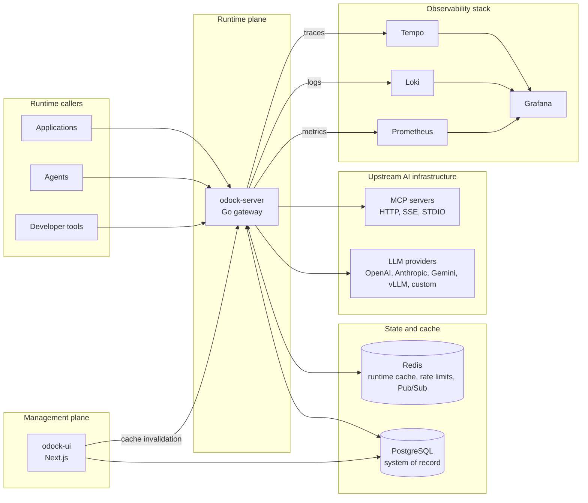
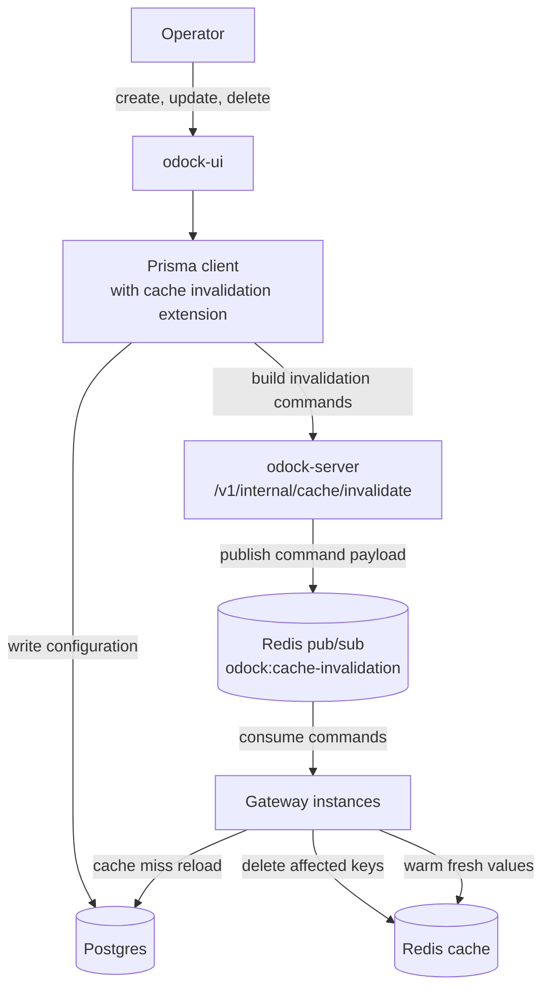
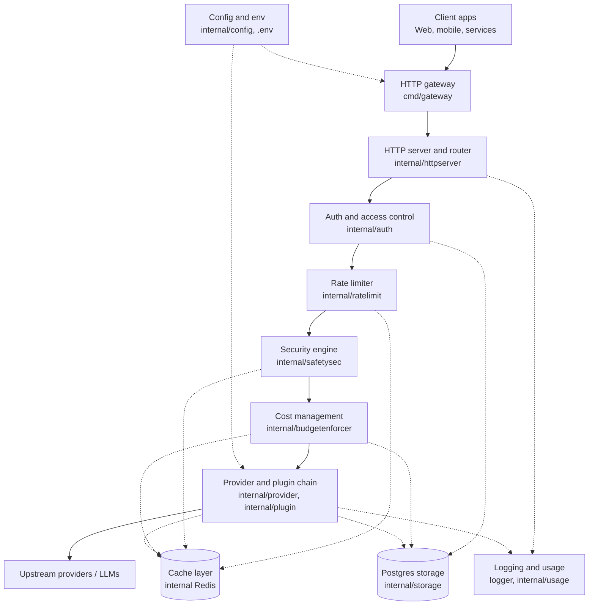
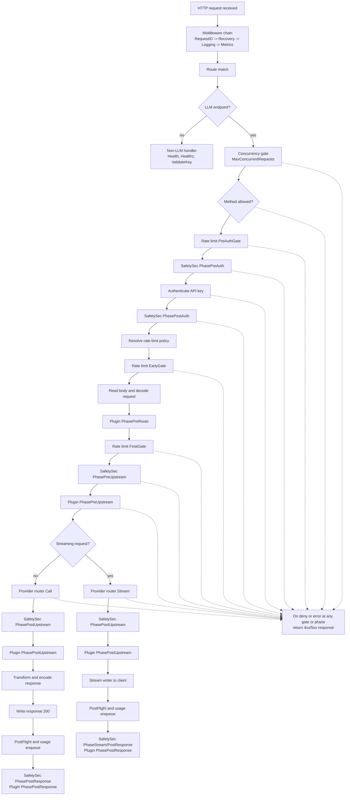
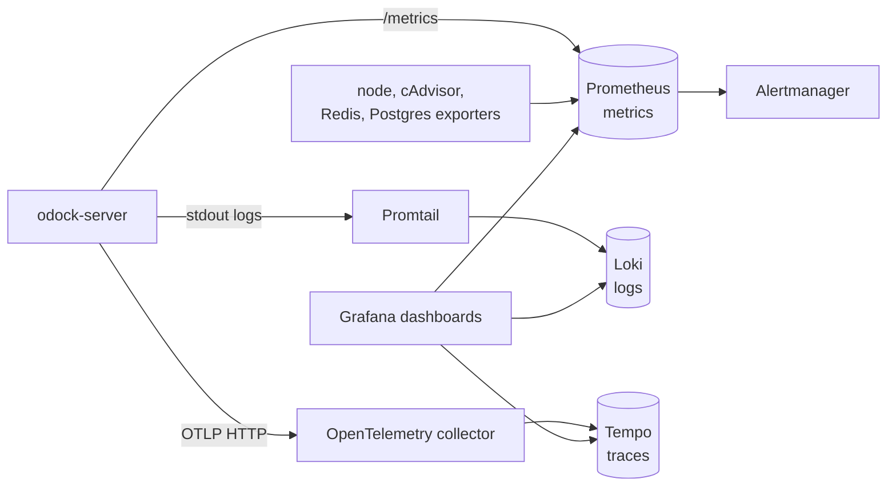

# Architecture

Odock separates management from runtime execution.

`odock-ui` is the management plane. It is a Next.js application that writes organisations, users, teams, providers, models, MCP servers, virtual API keys, budgets, quotas, policies, and usage views into Postgres.

`odock-server` is the runtime gateway. It receives LLM and MCP traffic, reads configuration from Postgres, keeps hot-path state in Redis, enforces governance, calls upstream providers or MCP servers, and records usage.

Postgres is the source of truth. Redis is the runtime acceleration and coordination layer for authentication cache entries, model and MCP metadata, rate-limit policies and counters, smart-routing policy state, SafetySec sessions, usage collection, and cache invalidation.

The optional observability stack collects metrics, logs, traces, dashboards, and alerts around the gateway and supporting infrastructure. See [Docker Compose](/docs/self-host/docker-compose) for the service list and [LGTM Stack](/docs/observability/lgtm-stack) for the observability details.

## Management Plane

The UI owns configuration workflows. Operators use it to manage identity, access, provider setup, model setup, MCP setup, routing, budgets, quotas, and usage review.

Configuration changes are persisted through Prisma into Postgres. The UI wraps Prisma with cache-invalidation hooks for mutating operations on runtime-sensitive models such as API keys, model access, organisations, teams, models, providers, provider keys, and MCP servers.

After a relevant mutation, the UI sends invalidation commands to `odock-server` at `/v1/internal/cache/invalidate`. The gateway validates the shared secret, publishes the commands to the Redis invalidation channel, and each gateway instance deletes the affected Redis keys. On the next request, the gateway reloads fresh state from Postgres and repopulates Redis.

This is why management writes are visible to runtime traffic without restarting the gateway. For the resources the UI manages, see [Organisations](/docs/user-management/organisation), [Users](/docs/user-management/users), [Teams](/docs/user-management/teams), [Virtual API Keys](/docs/management/virtual-api-keys), [Providers](/docs/models-and-mcp/providers), [Models](/docs/models-and-mcp/models), [MCP Servers](/docs/models-and-mcp/mcp-servers), [Budgets](/docs/management/budgets), and [Quotas](/docs/management/quotas).

## Gateway Architecture

`odock-server` is the gateway. The executable is `cmd/gateway`; it wires configuration, storage clients, repositories, auth, rate limiting, SafetySec, plugins, smart routing, provider clients, MCP cache, budget enforcement, usage collection, cache invalidation, and the HTTP server.

At runtime, the gateway accepts client traffic, routes it through the HTTP server, authenticates the virtual API key, applies access and rate-limit policy, runs security and cost controls, executes plugins, calls the selected provider or MCP server, records usage, and emits telemetry.

Important gateway modules:

| Module | Responsibility |
| --- | --- |
| `internal/httpserver` | HTTP routes, middleware, provider-compatible endpoints, unified LLM endpoint, MCP endpoint, health checks, metrics endpoint, and internal cache invalidation route. |
| `internal/auth` | Virtual API key authentication and Redis-backed positive/negative auth caching. |
| `internal/storage` | Postgres and Redis clients plus repositories that mirror the Prisma-backed schema. |
| `internal/modelcache` and `internal/mcpcache` | Redis-backed model, model-access, provider-key, and MCP server lookup caches. |
| `internal/ratelimit` | Redis-backed rate-limit policy resolution, policy cache, and request gates. |
| `internal/smartrouting` | Organisation-level routing enablement and per-API-key routing policy evaluation. |
| `internal/safetysec` | Request and response security phases for prompt injection, jailbreak, sensitive-data, and leakage checks. |
| `internal/plugin` and `internal/plugins` | Plugin chain execution before routing, before upstream calls, after upstream calls, and after responses. |
| `internal/budgetenforcer` | Budget and quota reservation, enforcement, and settlement. |
| `internal/usage` | Usage event collection, token and cost normalization, and usage record persistence. |
| `internal/observability` | Prometheus metrics, tracing helpers, context attributes, and gateway instrumentation. |

For deeper pages, see [Routing](/docs/management/routing), [Guardrails](/docs/security-and-guardrails/guardrails), [Security Engine](/docs/security-and-guardrails/safetysec-engine), [Plugin Architecture](/docs/plugins/architecture), [Plugin Lifecycle](/docs/plugins/plugin-lifecycle), and [Usage Monitoring](/docs/observability/usage-records).

## Request Lifecycle

Every runtime request starts in the HTTP server middleware chain. Non-LLM routes, such as health checks and key validation, leave the LLM lifecycle early. LLM routes continue through concurrency, method, rate-limit, SafetySec, auth, decode, plugin, budget, routing, provider, response, and usage stages.

The provider path supports Odock's unified LLM endpoint and provider-compatible endpoints for the currently available or compatible provider shapes. For calling patterns, see [Unified Multi Model Endpoint Call](/docs/usage/unified-multi-model-endpoint-call) and [Native Models Call](/docs/usage/native-models-call). For MCP behavior, see [MCP Servers](/docs/models-and-mcp/mcp-servers).

## Observability

The observability stack is optional for self-hosting, but the gateway is designed to emit telemetry when it is enabled.

`odock-server` exposes Prometheus metrics on `/metrics`, sends traces through OTLP HTTP, and writes structured logs to stdout. Prometheus stores metrics, Loki stores logs, Tempo stores traces, and Grafana reads all three for dashboards and incident investigation.

Gateway metrics cover requests, provider calls, cache lookups, rate-limit decisions, routing decisions, budget decisions, provider-key decrypt behavior, token usage, usage collection, and cache invalidation. Traces can include auth, routing, provider calls, usage collection, rate limits, budgets, plugins, and safety phases.

For setup and retention, see [Self-host Observability Stack](/docs/self-host/observability-stack). For metrics, logs, traces, dashboards, alerts, and OTEL environment variables, see [LGTM Stack](/docs/observability/lgtm-stack). For persisted usage and audit records in Postgres, see [Usage Monitoring](/docs/observability/usage-records).
