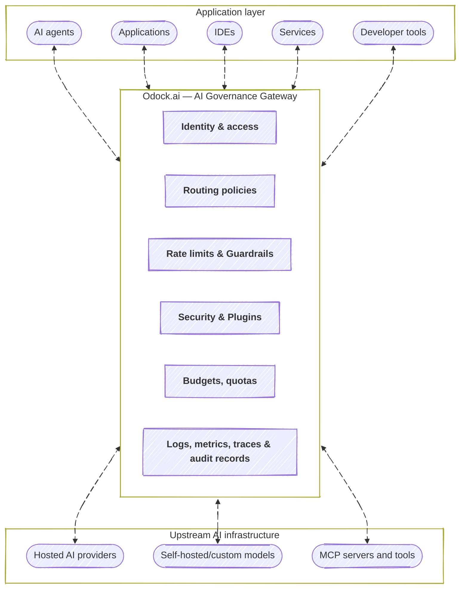

# What is Odock?

Odock is an AI governance gateway for LLM and MCP traffic.

It sits between your applications, agents, developer tools, and AI providers so every model call and tool call passes through one controlled entry point.

Instead of connecting each application directly to OpenAI, Anthropic, Google, Azure OpenAI, vLLM, custom models, or MCP servers, Odock centralizes how AI traffic is managed.

With Odock, teams can control:

- who can access which models and MCP tools
- which provider keys are used
- how requests are routed
- how budgets, quotas, and rate limits are enforced
- how usage, cost, latency, and errors are tracked
- which security checks run before and after requests

## Why Use Odock?

AI adoption often starts with a few direct API calls. That works for experiments, but it becomes hard to manage when multiple teams, providers, models, agents, and MCP tools move into production.

Without a gateway, API keys are copied across services, costs are hard to attribute, model access is difficult to control, and security policies depend on each application.

Odock solves this by putting governance directly in the request path. Every call is authenticated, checked, routed, recorded, and monitored before it reaches an upstream provider or MCP server.

## Where Odock Fits

Odock is useful when AI traffic becomes shared infrastructure.

<Cards>
  <Card
    title="Centralize LLM Access"
    description="Expose approved models to all teams through one governed gateway instead of scattered direct provider calls."
  />

  <Card
    title="Protect Provider Keys"
    description="Keep OpenAI, Anthropic, Google, Azure OpenAI, vLLM, and custom provider credentials behind Odock."
  />

  <Card
    title="Give Developers One Entry Point"
    description="Support OpenAI-compatible, Anthropic-compatible, Gemini-compatible, vLLM-compatible, and unified Odock endpoints."
  />

  <Card
    title="Control Access"
    description="Define who can use each model or MCP tool by organisation, team, user, or virtual API key."
  />

  <Card
    title="Manage Spend"
    description="Use budgets, quotas, reservations, and usage records to control consumption before costs grow."
  />

  <Card
    title="Govern MCP Tools"
    description="Control which agents and API keys can access MCP servers, tools, and semantic rules."
  />

  <Card
    title="Route Without Rewrites"
    description="Change providers, models, or routing policies without redeploying every application."
  />

  <Card
    title="Add Security and Visibility"
    description="Apply guardrails, logs, metrics, traces, and audit records around every AI request."
  />
</Cards>

## What Odock Controls

| Area                | Purpose                                                                                   |
| ------------------- | ----------------------------------------------------------------------------------------- |
| Identity and access | Manage organisations, users, teams, roles, virtual API keys, model grants, and MCP grants |
| Provider management | Store provider configuration and encrypted provider keys centrally                        |
| Cost controls       | Enforce budgets, quotas, reservations, and usage tracking                                 |
| Routing             | Decide which provider or model handles each request                                       |
| Security            | Apply policies, rate limits, SafetySec checks, and plugin hooks                           |
| Observability       | Track logs, metrics, latency, errors, routing attempts, and usage                         |

