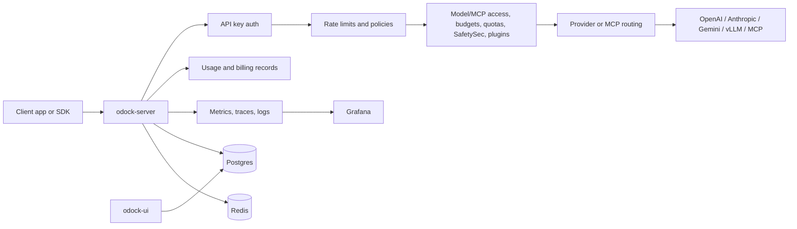

# What Is Odock?

Odock is an AI governance layer that sits between client applications and model or MCP providers. It combines three parts:

- `odock-server`: the active gateway that receives AI traffic, authenticates API keys, enforces rate limits, applies budgets and quotas, runs SafetySec checks, executes plugins, routes to providers, proxies MCP servers, records usage, and emits telemetry.
- `odock-ui`: the control plane used by administrators and organisation users to configure organisations, teams, users, providers, models, MCP servers, API keys, access rules, routing policy, budgets, quotas, invoices, and playground requests.
- The observability layer: the Docker Compose profile and `observability/` configuration that runs Prometheus, Loki, Tempo, Grafana, OpenTelemetry Collector, Promtail, Alertmanager, exporters, and dashboards.

The result is a platform where AI usage is not just forwarded to an upstream provider. Every request can be identified, governed, billed, monitored, and audited.

## Who Uses It

Odock has several operator and user personas:

- Platform owners run the full stack, configure provider credentials, and monitor health.
- Super admins manage all organisations and all shared platform configuration.
- Organisation admins manage one organisation: users, teams, providers, models, MCP servers, API keys, policies, budgets, quotas, usage, invoices, and settings.
- Managers get team-scoped operational access.
- Users get limited self-service access, usage visibility, invoices, and the AI playground according to RBAC policy.
- Client applications call the gateway with Odock API keys instead of direct provider keys.

## Core Jobs

Odock is designed around these operational jobs:

- Centralize provider access through a single LLM gateway.
- Replace direct provider API keys in applications with governed Odock API keys.
- Configure which models and MCP servers each API key can use.
- Enforce scoped rate limits before and after request normalization.
- Enforce spend and quota limits with reservation and settlement.
- Track token, cost, latency, HTTP status, provider usage, MCP usage, and routing metadata.
- Apply security checks for prompt injection, jailbreak patterns, sensitive data, and data leakage.
- Run request lifecycle plugins.
- Route across fallback models when smart routing is enabled.
- Observe the platform with metrics, traces, logs, alerts, and Grafana dashboards.

## How Traffic Flows

At runtime, client traffic goes to `odock-server`, not to OpenAI, Anthropic, Gemini, vLLM, or an MCP server directly.

## What The Platform Governs

Odock governs both LLM and MCP usage.

LLM governance covers:

- Providers: OpenAI, Anthropic, Google/Gemini, Azure OpenAI, vLLM, and custom OpenAI-compatible providers.
- Models: the organisation-facing model name, upstream slug, provider mapping, model type, capabilities, pricing, and policies.
- API keys: organisation, team, or user scoped credentials used by client applications.
- Model access: explicit API-key-to-model grants.
- Smart routing: per-API-key routing policies for failover, priority, round robin, and native provider fallback.

MCP governance covers:

- MCP servers with `STREAMABLE_HTTP`, `SSE`, or `STDIO` transports.
- Optional team or API-key ownership.
- Allowed and blocked tools.
- MCP access grants per API key.
- MCP pricing, usage records, rate-limit policy, and metadata.

## What Is Current And What Is Not

This documentation is written against the current repository implementation.

Current implemented paths include:

- API key authentication with Redis positive and negative cache.
- Gateway endpoints for OpenAI-compatible chat, responses, embeddings, image endpoints, Anthropic messages, Gemini generate content, vLLM endpoints, a unified Odock chat endpoint, and a unified MCP endpoint.
- Provider key browser encryption in the UI and in-memory decryption in the server.
- Model and MCP access caches.
- Redis-backed staged rate limiting.
- Postgres-backed budget and quota reservations.
- Usage recording with normalized token and billing records.
- SafetySec security modules.
- Config-driven bundled plugins.
- Smart routing and cache invalidation.
- Fumadocs documentation site.
- Docker Compose orchestration and an optional LGTM observability profile.

Some older source docs in subprojects describe earlier states of the system. Where they conflict with the code, this documentation follows the code.
