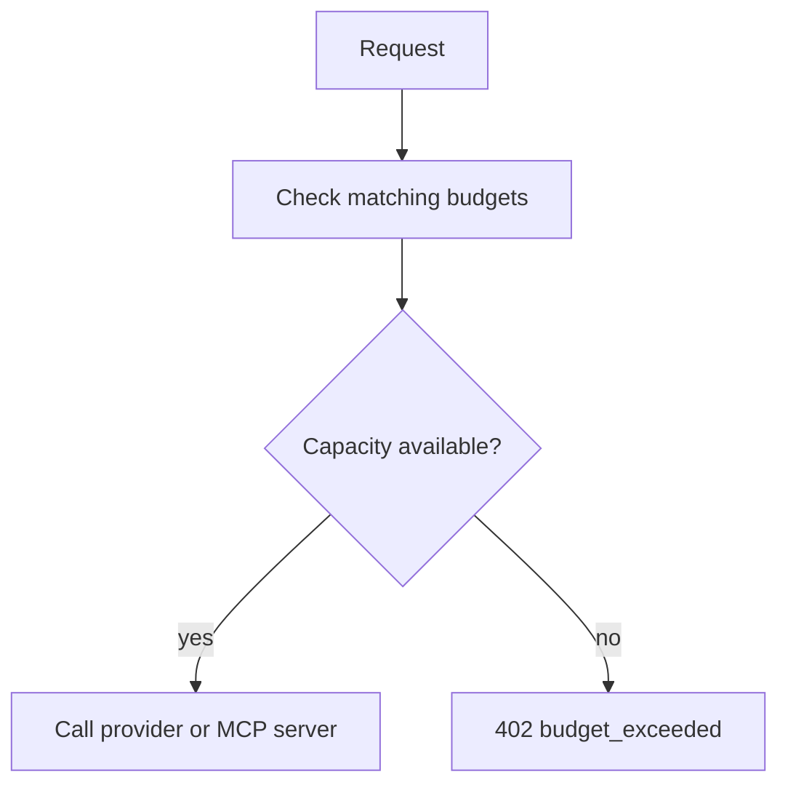

# Handle budget exceeded

When any active matching budget lacks capacity, the gateway rejects the request before the upstream provider call with `402 budget_exceeded`.

## What The Application Should Do

Treat budget exhaustion as a hard cost-control response.

Good responses include:

- pause non-critical work,
- wait for the next budget window,
- ask the owner to raise the budget,
- switch to a lower-cost workflow if your application is designed for that,
- alert the team responsible for the key or budget.

Avoid immediate retry loops. The request will usually fail again until capacity changes.

## Troubleshooting Checklist

<Steps>

<Step>
Identify the API key used by the failed request.
</Step>

<Step>
Open the key and review attached budgets.
</Step>

<Step>
Check whether the key is organisation-, team-, or user-scoped.
</Step>

<Step>
Open **Budgets** and filter for matching organisation, team, user, and API-key budgets.
</Step>

<Step>
Open each active matching budget and review the current window.
</Step>

<Step>
Check used plus reserved consumption against the limit.
</Step>

<Step>
Review Usage Records for the budget window.
</Step>

</Steps>

