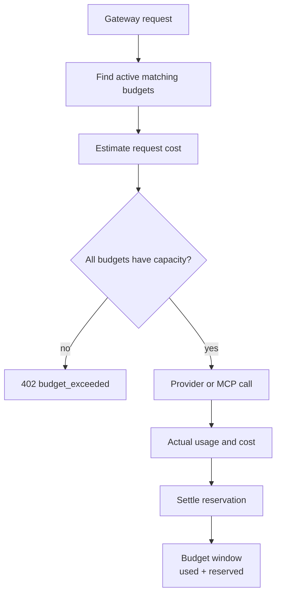

# Budgets

Budgets enforce cost ceilings. They protect an organisation, team, user, or API key from spending more than the configured amount during a time window.

Odock reserves estimated cost before the upstream call and settles actual cost after completion. This prevents concurrent requests from overspending a budget before usage records are written.

## Budget Runtime Flow

## Pages In This Submenu

- [Owner inheritance](/docs/management/budgets/owner-inheritance)
- [Windows and reservations](/docs/management/budgets/windows-and-reservations)
- [Amounts and thresholds](/docs/management/budgets/amounts-and-thresholds)
- [Create a budget](/docs/management/budgets/create-budget)
- [Create an API-key budget](/docs/management/budgets/api-key-budget)
- [Monitor a budget](/docs/management/budgets/monitor-budget)
- [Handle budget exceeded](/docs/management/budgets/budget-exceeded)
