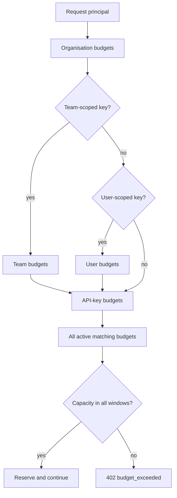

# Owner inheritance

All active matching budgets apply. A request must fit every budget in the principal chain.

| Owner type | Applies to | Typical use |
| --- | --- | --- |
| `ORG` | All matching organisation traffic. | Monthly organisation-wide ceiling. |
| `TEAM` | Traffic from team-scoped keys for the selected team. | Department or product budget. |
| `USER` | Traffic from user-scoped keys for the selected user. | Personal experimentation budget. |
| `APIKEY` | Traffic from one virtual API key. | Application, environment, or customer cap. |

## Example

A team-scoped key for the "Search" team can be stopped by:

- the organisation monthly budget,
- the Search team weekly budget,
- the API key daily budget.

This layered behavior is intentional. Broader budgets protect shared spend, and narrower budgets protect applications or owners.
