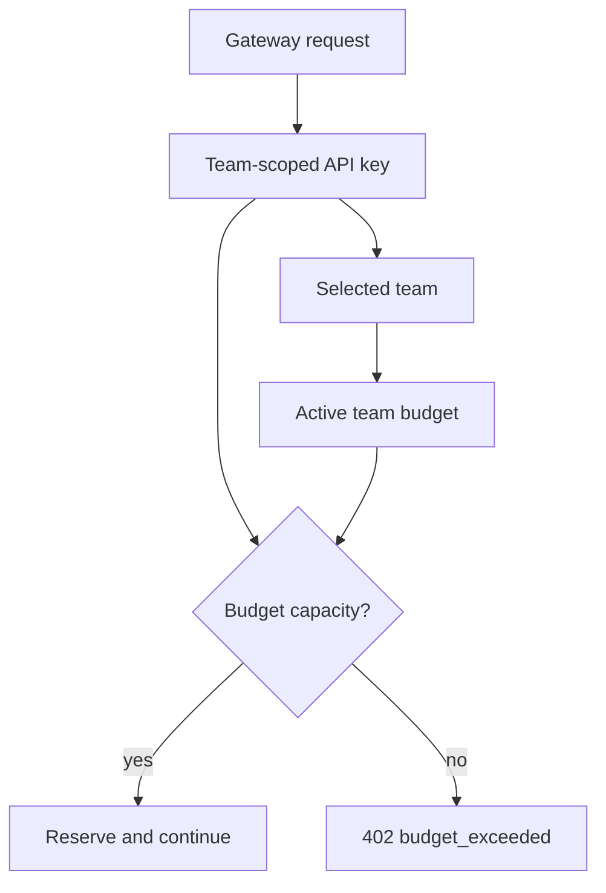

# Create a team budget

Use a team budget when a team should have its own spend ceiling inside the organisation budget. Team budgets apply to traffic from API keys scoped to that team.

For example, if the organisation has a monthly global budget, you can also give the Support team a weekly or monthly budget so that team cannot consume the full organisation budget alone.

<Steps>

<Step>
Open your organisation workspace.
</Step>

<Step>
Open **Budgets** from the sidebar.
</Step>

<Step>
Click **Add New Budget**.
</Step>

<Step>
Enter a name, such as `Engineering weekly budget` or `Engineering team monthly budget`.
</Step>

<Step>
Set **Owner Type** to **Team**.
</Step>

<Step>
Select the team that should own the budget.
</Step>

<Step>
In **Schedule**, choose the start date, timezone, and period.
</Step>

<Step>
Use **Weekly** for a recurring weekly team envelope, or **Monthly** for a monthly team ceiling.
</Step>

<Step>
Leave **End At** empty if the team budget should keep applying every period.
</Step>

<Step>
In **Limits**, choose currency and enter the amount.
</Step>

<Step>
Select threshold percentages if you want warning points.
</Step>

<Step>
Keep **Active** checked and create the budget.
</Step>

</Steps>

## How It Is Enforced

A team budget is checked when the request uses a team-scoped API key for that team.

The request may still also be checked against organisation budgets and API-key budgets. All active matching budgets must have capacity.

## Common Setup

Use layered budgets:

- Organisation monthly budget for the global ceiling.
- Team weekly budget for short-term team control.
- API-key daily budget for a specific app or workflow.
