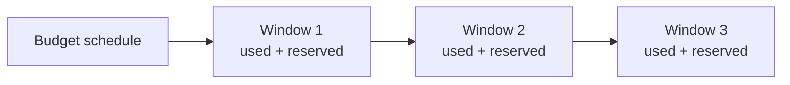
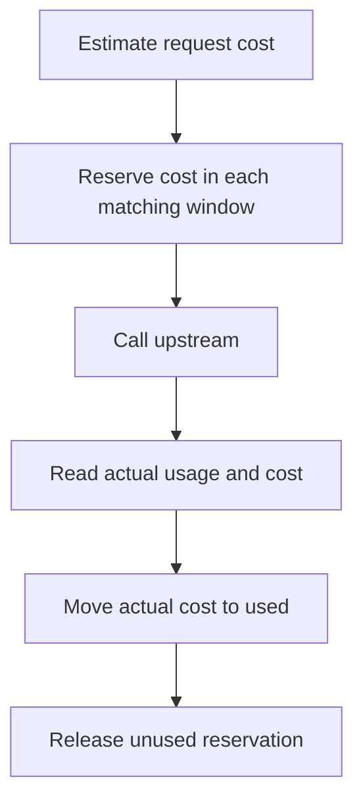

# Windows and reservations

A budget schedule creates windows. Each window tracks:

- used cost,
- reserved cost,
- start and end time,
- currency.

| Schedule field | Meaning |
| --- | --- |
| Start At | When the budget schedule begins. |
| Period | `DAILY`, `WEEKLY`, `MONTHLY`, or `QUARTERLY`. |
| Timezone | Timezone used for window boundaries. |
| End At | Optional time after which the budget is inactive. |
| Rollover | Whether unused capacity can roll forward when supported. |
| Active | Whether the budget is enforced. |

## Reservation Lifecycle

Reserved cost means capacity is held for in-flight or unreconciled requests. Used cost means the request has been settled with actual usage.

## Why Reservations Matter

Without reservations, many concurrent requests could all pass the same budget check before any usage record is written. Reservations prevent that race by reducing available budget before the upstream call starts.
