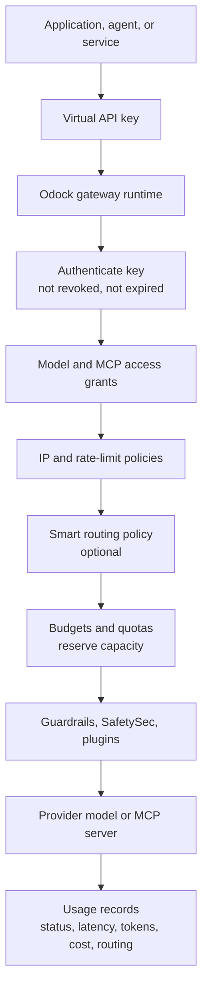
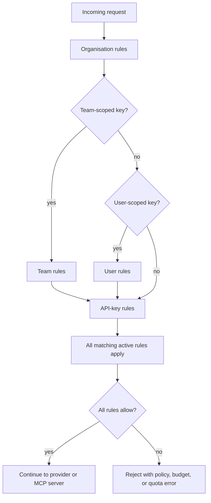
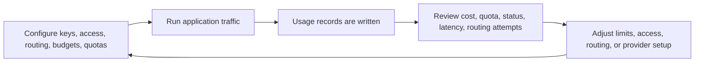

# Management

Management is the runtime control layer for Odock. It answers five practical questions for every gateway call:

- Who is calling?
- Which models or MCP servers can the caller use?
- Should the request go directly to the requested model or be routed to another candidate?
- Is there enough budget or quota capacity for the request?
- How can the organisation monitor what happened after the call?

This section is written for organisation users who manage applications, teams, and API keys. If you need to connect providers or create model records first, start with [Models & MCP](/docs/models-and-mcp). If you need request safety, content filtering, or plugin behavior, see [Guardrails](/docs/security-and-guardrails/guardrails), [SafetySec Engine](/docs/security-and-guardrails/safetysec-engine), and [Plugins](/docs/plugins).

## What Management Controls

Management sits between your application and the upstream model or MCP server.

The virtual API key is the runtime identity. The gateway uses it to find the organisation, optional team, optional user, explicit model/MCP grants, key-level policies, routing rules, and cost controls.

## The Runtime Principal

Every request is evaluated with a principal. A principal is the identity chain attached to the API key:

| API key type | Principal chain | Typical use |
| --- | --- | --- |
| `ORGANISATION` | Organisation -> API key | Shared backend service, central integration, CI job. |
| `TEAM` | Organisation -> Team -> API key | Team-owned product, workflow, or deployment. |
| `USER` | Organisation -> User -> API key | Personal automation, testing, notebook, or developer workflow. |

The key type does not automatically grant model or MCP access. A team-scoped key still needs explicit model access. A user-scoped key still needs explicit MCP access. Scope affects attribution and the budgets, quotas, and policies that are checked.

## How Scope Is Inherited

Management rules are additive. The gateway checks every active rule that matches the request's principal. A request must satisfy all of them.

For budgets and quotas, "most specific" does not mean "only the most specific rule wins." It means more specific owners can add tighter limits, but broader organisation or team limits still protect the shared pool. For example, a team key can be stopped by the organisation monthly budget, the team weekly token quota, or the key's own daily cost budget.

## Runtime Lifecycle

At a high level, a gateway request moves through these phases:

1. The application sends a request with an Odock virtual API key.
2. The gateway authenticates the key and checks expiry/revocation.
3. The gateway resolves organisation, team, user, and API-key context.
4. IP and rate-limit policies are evaluated.
5. The request body is decoded and the requested model or MCP server is resolved.
6. The gateway checks that the key has explicit access to the model or MCP server.
7. Smart routing may choose a candidate model or fallback chain.
8. Budget and quota capacity is reserved before the upstream call.
9. Guardrails, SafetySec modules, and plugins run at their configured phases.
10. The gateway calls the upstream provider or MCP server.
11. Actual tokens, bytes, latency, status, routing attempts, and cost are recorded.
12. Budget and quota reservations are settled or released.

For endpoint request formats, see [Native Models call](/docs/usage/native-models-call) and [Unified Multi Model Endpoint Call](/docs/usage/unified-multi-model-endpoint-call).

## What To Configure First

Use this order for a practical production setup:

1. Confirm the provider, model, and MCP resources exist in [Models & MCP](/docs/models-and-mcp).
2. Create a virtual API key for the application or workflow.
3. Grant model access and MCP access to the key.
4. Add IP and rate-limit policies if the key is used from predictable infrastructure.
5. Add budgets to protect spend.
6. Add quotas to protect request volume, token volume, errors, cost, or latency.
7. Enable organisation routing and configure API-key routing when you need failover or model distribution.
8. Test with the [AI Playground](/docs/tools/ai-playground) or a direct API call.
9. Monitor [Usage Records](/docs/observability/usage-monitoring), budget windows, quota windows, and routing attempts.

## UI Map

In the organisation workspace, the management pages are available from the sidebar:

| Page | Use it for |
| --- | --- |
| **API Keys** | Create keys, reveal once, rotate, revoke, grant model/MCP access, edit policies, configure routing, review usage, attach budgets and quotas. |
| **Budgets** | Create cost ceilings by organisation, team, user, or API key and monitor spending windows. |
| **Quotas** | Create numeric limits by metric and monitor quota windows. |
| **Usage Records** | Audit individual requests, including status, latency, provider, model, token usage, cost, and routing details. |
| **Settings** | Enable or disable smart routing for the organisation and manage organisation-level policies. |

## Monitoring Loop

Management is not only setup. It is a feedback loop.

Review usage records after each rollout. They show whether requests used the expected key, model, provider, route, and cost profile. Budget and quota pages then show how that request-level activity accumulates inside the active time windows.

## Pages In This Section

- [Virtual API Keys](/docs/management/virtual-api-keys): runtime credentials, scope, access grants, policies, rotation, and monitoring.
- [Routing](/docs/management/routing): organisation routing switch, API-key routing policies, model-type routing, native endpoint fallback, and multi-model routing.
- [Budgets](/docs/management/budgets): spend ceilings, owner inheritance, reservation and settlement, schedule windows, and monitoring.
- [Quotas](/docs/management/quotas): request/token/error/cost/latency limits, reservation and settlement, metric windows, and monitoring.
