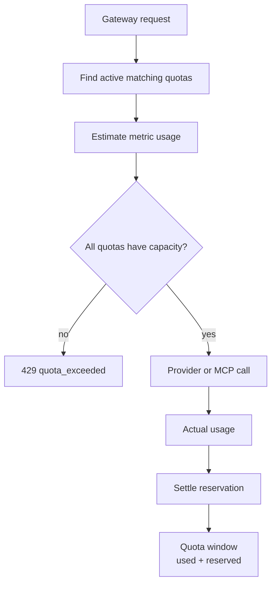

<Callout type="tip">
Quotas and budgets follow the same core principles and workflows. In general, any workflow that applies to budgets can also be applied to quotas.
</Callout>

# Quotas

Quotas enforce numeric usage ceilings. Where budgets control spend, quotas control measurable runtime activity such as request count, token count, errors, cost, and latency.

Use quotas to protect workloads from unexpected volume, runaway jobs, broken integrations, and noisy clients.

## Quota Runtime Flow

## Pages In This Submenu

- [Quota metrics](/docs/management/quotas/metrics)
- [Owner inheritance](/docs/management/quotas/owner-inheritance)
- [Windows and reservations](/docs/management/quotas/windows-and-reservations)
- [Quotas vs rate limits](/docs/management/quotas/quotas-vs-rate-limits)
- [Create a quota](/docs/management/quotas/create-quota)
- [Create an API-key quota](/docs/management/quotas/api-key-quota)
- [Monitor a quota](/docs/management/quotas/monitor-quota)
- [Handle quota exceeded](/docs/management/quotas/quota-exceeded)
