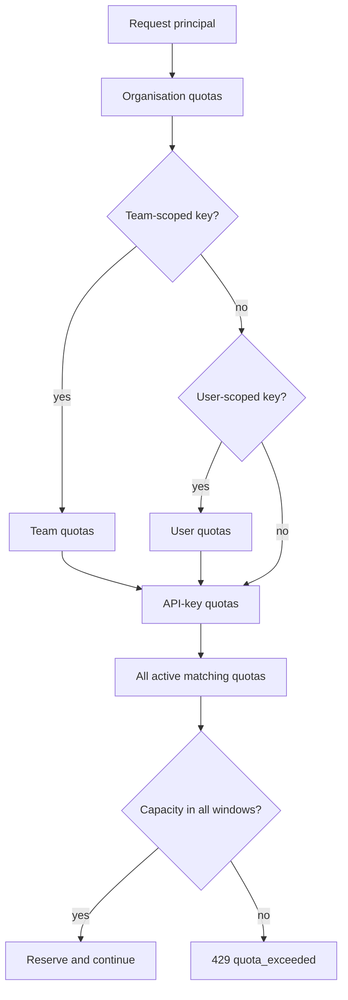

# Owner inheritance

All active matching quotas apply. A request must fit every quota in the principal chain.

| Owner type | Applies to | Typical use |
| --- | --- | --- |
| `ORG` | All matching organisation traffic. | Organisation request or token ceiling. |
| `TEAM` | Traffic from team-scoped keys for the selected team. | Team usage envelope. |
| `USER` | Traffic from user-scoped keys for the selected user. | Personal experimentation limit. |
| `APIKEY` | Traffic from one virtual API key. | Application, environment, or customer limit. |

## Example

A user-scoped key can be stopped by:

- an organisation daily requests quota,
- a user weekly token quota,
- an API-key daily errors quota.
