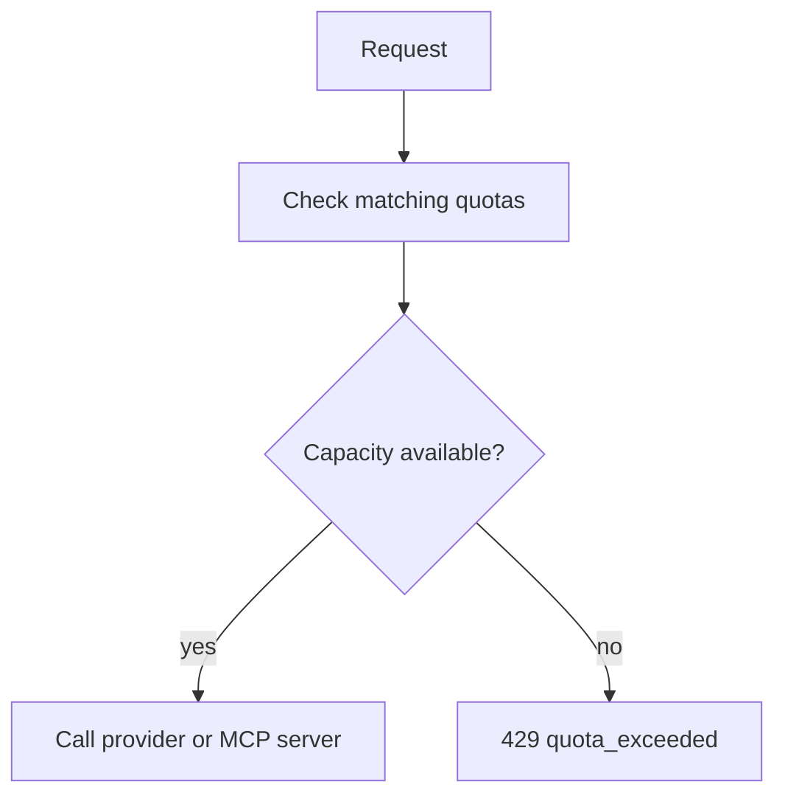

# Handle quota exceeded

When any active matching quota lacks capacity, the gateway rejects the request before the upstream provider call with `429 quota_exceeded`.

## What The Application Should Do

Treat quota exhaustion as a limit response.

Good responses include:

- slow down,
- wait for the next quota window,
- stop the current batch,
- ask the owner to raise the quota,
- investigate whether a deployment is sending unexpected traffic.

Avoid tight retry loops. The request will usually fail again until capacity changes or the window resets.

## Troubleshooting Checklist

<Steps>

<Step>
Identify the API key used by the failed request.
</Step>

<Step>
Check whether the key is organisation-, team-, or user-scoped.
</Step>

<Step>
Open **Quotas** and filter for matching organisation, team, user, and API-key quotas.
</Step>

<Step>
Open each active matching quota.
</Step>

<Step>
Review the current window's used plus reserved value.
</Step>

<Step>
Compare the consumed value with the configured limit.
</Step>

<Step>
Review Usage Records for the quota window.
</Step>

</Steps>

> Screenshot placeholder: quota detail page showing an exhausted current window.
