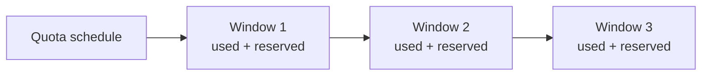
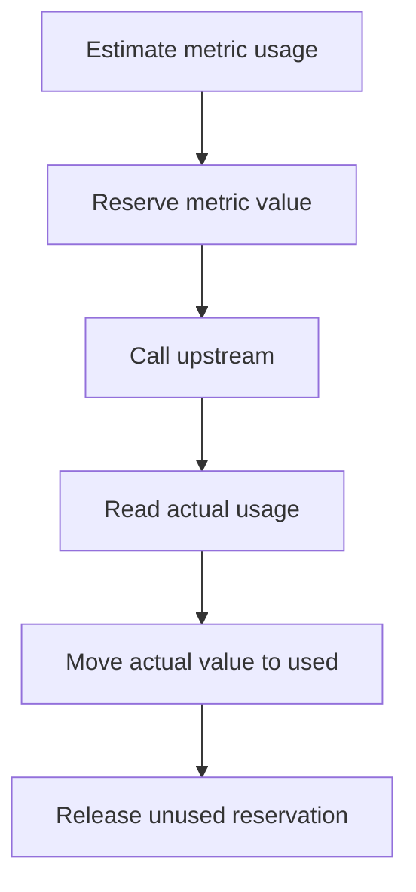

# Windows and reservations

A quota schedule creates windows. Each window tracks:

- metric,
- used value,
- reserved value,
- start and end time.

| Schedule field | Meaning |
| --- | --- |
| Start At | When the quota schedule begins. |
| Period | `DAILY`, `WEEKLY`, `MONTHLY`, or `QUARTERLY`. |
| Timezone | Timezone used for window boundaries. |
| End At | Optional time after which the quota is inactive. |
| Rollover | Whether unused capacity can roll forward when supported. |
| Active | Whether the quota is enforced. |

## Reservation Lifecycle

For `REQUESTS`, the estimate is usually one request. For tokens and cost, Odock can reserve an estimate and settle after the provider returns exact usage.
