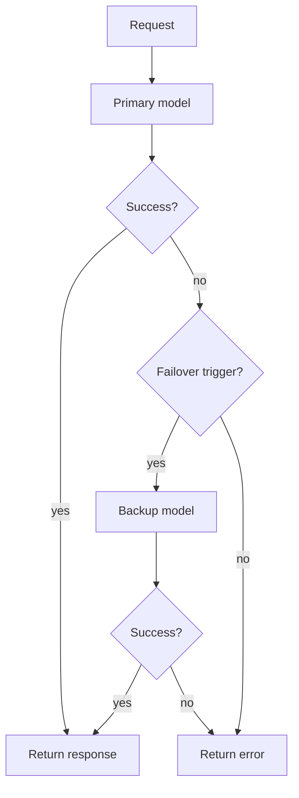

# Build a failover plan

Use this pattern when one model should be primary and another should be backup.

<Steps>

<Step>
Grant the API key access to the primary model.
</Step>

<Step>
Grant the API key access to the backup model.
</Step>

<Step>
Enable organisation routing in **Settings**.
</Step>

<Step>
Open the API key and scroll to **Routing**.
</Step>

<Step>
Select the correct model type.
</Step>

<Step>
Choose **Failover** or **Priority**.
</Step>

<Step>
Put the primary model first.
</Step>

<Step>
Put the backup model second.
</Step>

<Step>
Enable `5xx` and `timeout` as failover triggers.
</Step>

<Step>
Add `rate_limit` only if an upstream/provider rate-limit error, such as HTTP `429`, should move traffic to the backup. In routing docs, `rate_limit` means the routing failover trigger for a failed attempt; it does not mean Odock quota enforcement or API-key rate-limit policy enforcement.
</Step>

<Step>
Run a test request and review the usage record routing card.
</Step>

</Steps>

