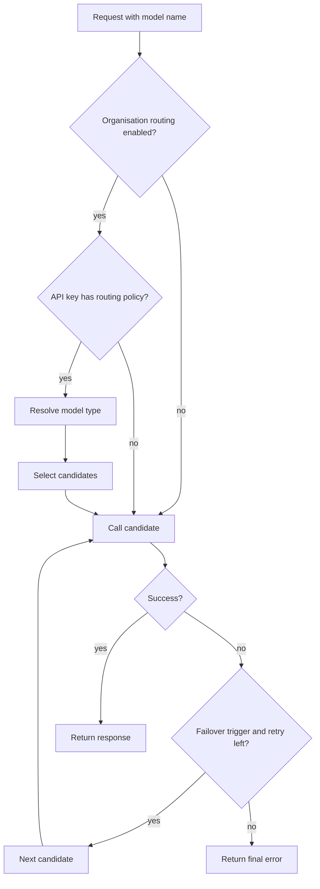

# Routing

Smart routing lets Odock choose among approved model candidates at runtime. It is configured at two levels:

1. The organisation routing switch enables routing for the organisation.
2. The API-key routing policy defines candidates and strategy for that key.

If the switch is disabled, requests behave as direct model calls. If the switch is enabled but a key has no routing policy, that key also behaves as a direct model call.

## Runtime Flow

Routing never bypasses access grants. Every routing candidate must be a model the key can access.

## Pages In This Submenu

- [Routing concepts](/docs/management/routing/routing-concepts)
- [Native vs unified routing](/docs/management/routing/native-vs-unified-routing)
- [Routing strategies](/docs/management/routing/routing-strategies)
- [Enable organisation routing](/docs/management/routing/enable-organisation-routing)
- [Configure API-key routing](/docs/management/routing/configure-api-key-routing)
- [Build a failover plan](/docs/management/routing/build-failover-plan)
- [Monitor routing](/docs/management/routing/monitor-routing)
