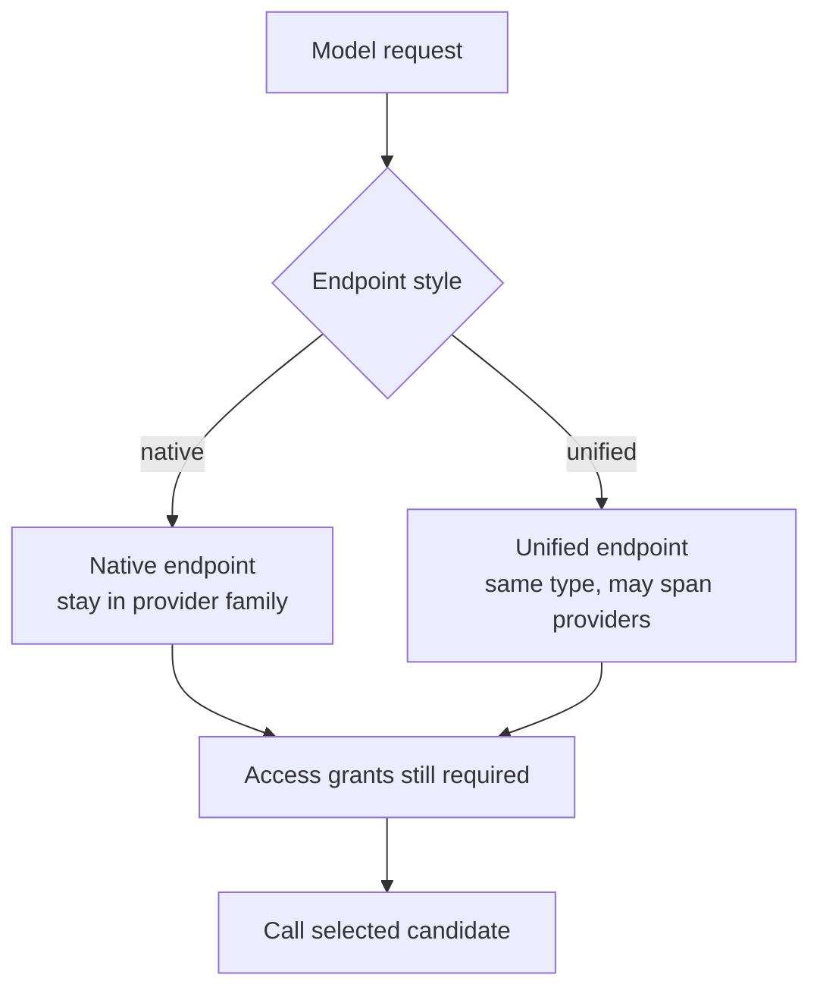

# Native vs unified routing

Routing depends on the endpoint style the application uses.

## Native Provider Endpoints

Native endpoints keep a provider-compatible API shape, such as OpenAI-compatible `/v1/chat/completions` or Anthropic-compatible `/v1/messages`.

The endpoint family pins the provider family. Native fallbacks should stay inside that family.

Examples of native routing provider keys:

- `openai`
- `anthropic`
- `gemini`
- `vllm`
- `mistral`

Use native endpoints when the application already uses a provider SDK and you want a small migration. See [Native Models call](/docs/usage/native-models-call).

## Unified Multi-Model Endpoint

The unified endpoint is Odock-centered. It can choose among candidates across providers as long as every candidate:

- is in the same organisation,
- has the same model type,
- is accessible to the API key.

Use unified routing when you want Odock to decide between equivalent model records across providers. See [Unified Multi Model Endpoint Call](/docs/usage/unified-multi-model-endpoint-call).

## Choosing The Endpoint

| Need | Choose |
| --- | --- |
| Keep existing OpenAI, Anthropic, Gemini, or vLLM client shape | Native endpoint |
| Route across multiple providers behind one Odock behavior | Unified endpoint |
| Preserve provider-specific payload features | Native endpoint |
| Centralize model choice in Odock | Unified endpoint |
