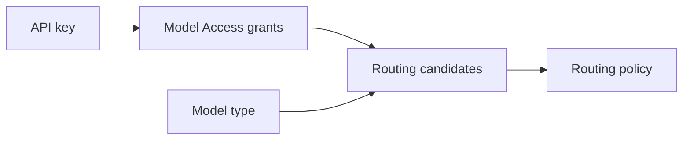

# Routing concepts

Routing policies are grouped by model type. A routing rule for `chat` only uses chat models. A routing rule for `embeddings` only uses embeddings models.

Common model types include:

- `chat`
- `reasoning`
- `image`
- `embeddings`
- `audio`
- `moderation`
- `transcription`
- `tts`

The model type comes from the configured model record. For model setup, see [Models](/docs/models-and-mcp/models).

## Candidates

Candidates are Odock model names that the API key can access. They are not raw provider slugs.

## Failover Triggers

| Trigger | Meaning |
| --- | --- |
| `5xx` | Upstream or gateway server-side failure. |
| `timeout` | Attempt exceeded timeout. |
| `rate_limit` | The attempted upstream/provider call returned a rate-limit error, such as HTTP `429`, or an error containing `rate_limit` / `rate limit`. This is a routing failover trigger, not Odock quota or key-policy enforcement. |
| `any` | Any error can trigger failover. |

Use `any` carefully because it can retry application errors that should be fixed instead.

## Retry Settings

| Setting | Meaning |
| --- | --- |
| Max retries | Number of additional attempts after the first attempt. |
| Retry delay (ms) | Delay before the next candidate is tried. |

More retries can improve availability but also increase latency. Keep user-facing flows conservative.

## Routing Records

Usage records can show:

- direct vs rerouted status,
- attempt count,
- final provider and model,
- each attempt's provider, model, outcome, and error.

These records are the best way to validate routing behavior after rollout.
