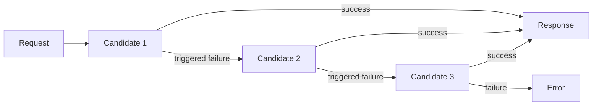

# Routing strategies

The strategy controls candidate order and retry behavior.

| Strategy | Behavior | Best for |
| --- | --- | --- |
| `failover` | Try candidates in order and move to the next candidate when a configured failover condition happens. | Provider outage protection. |
| `priority` | Prefer the highest-priority candidate first. Lower number means earlier. | Primary/secondary model plans. |
| `round_robin` | Rotate requests across candidates. | Simple distribution across equivalent deployments. |

## Failover

## Priority

Priority is useful when one candidate is preferred for cost, quality, region, or contractual reasons. Put the preferred model first and backup models later.

## Round Robin

Round robin is useful when candidates are equivalent enough that distributing requests is acceptable. Do not use it across models with very different output quality unless the application can tolerate that variation.

## Strategy Checklist

- Use the same model type for all candidates.
- Grant each candidate model to the key.
- Keep retries small for latency-sensitive traffic.
- Review usage records after enabling the policy.
