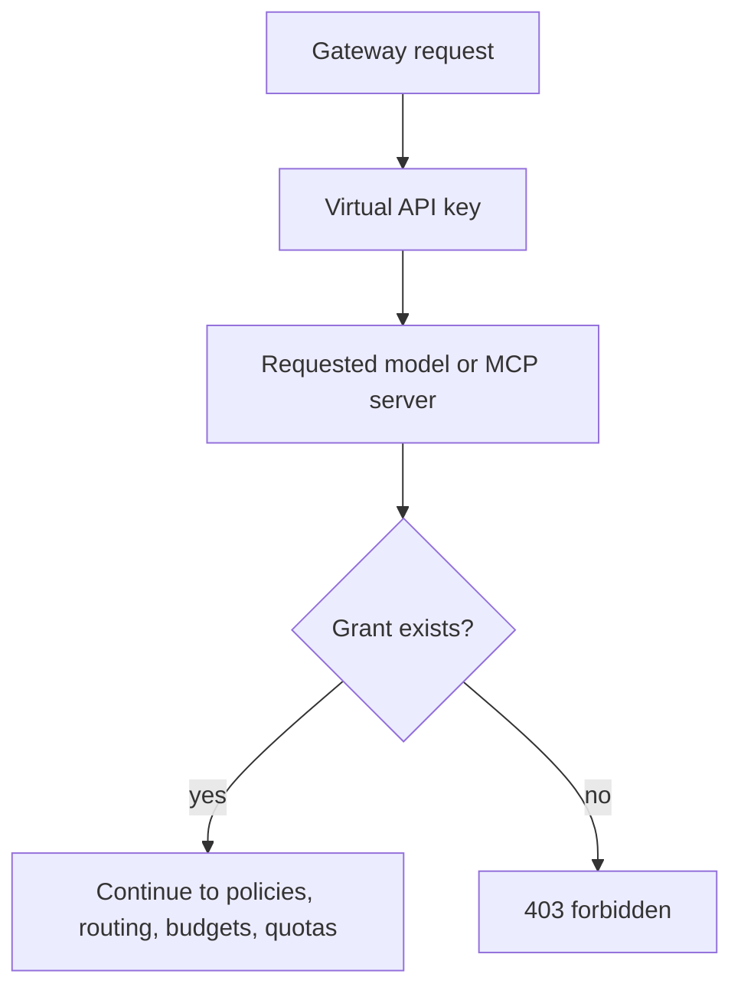
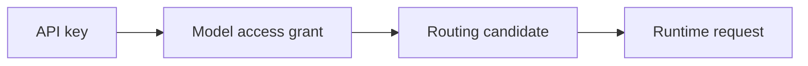

# Access grants

Access grants are explicit allow rules between a virtual API key and a runtime resource.

- **Model Access** lets the key call one or more configured models.
- **MCP Access** lets the key call one or more configured MCP servers.

The gateway checks grants after authentication and before provider or MCP execution.

## Grant Direction

You can manage grants from either side:

| Starting point | UI section | Best when |
| --- | --- | --- |
| API key detail page | Model Access or MCP Access | You are setting up one application key. |
| Model detail page | API Key Access | You are exposing one model to several keys. |
| MCP server detail page | API Key Access | You are exposing one tool server to several keys. |

For model-specific workflows, see [Grant a model to an API key](/docs/models-and-mcp/models/grant-model-to-api-key). For MCP-specific workflows, see [Grant MCP to API key](/docs/models-and-mcp/mcp-servers/grant-mcp-to-api-key).

## Routing Dependency

Routing candidates must also be accessible to the key. If a model is not granted, it should not be available in the routing editor and should not be used at runtime.

## Review Checklist

- The key belongs to the expected organisation, team, or user.
- The requested model name exists in the organisation.
- The key has Model Access for that model.
- The requested MCP server exists and is enabled.
- The key has MCP Access for that server.
- Any routed fallback model is also granted to the key.
