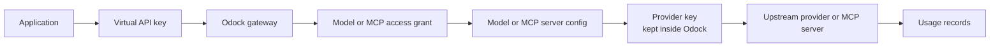

# Virtual API Keys

Virtual API keys are the credentials your applications use to call Odock. They are separate from upstream provider keys. Your application sends the virtual key to the gateway; Odock resolves the configured model or MCP server and uses its internal provider configuration to call upstream systems.

This separation gives you one runtime identity for governance:

- explicit model and MCP access grants,
- owner attribution by organisation, team, user, and key,
- budgets and quotas,
- IP and rate-limit policies,
- routing policies,
- usage records for audit and billing.

For provider credentials and model setup, see [Providers](/docs/models-and-mcp/providers), [Models](/docs/models-and-mcp/models), and [MCP Servers](/docs/models-and-mcp/mcp-servers).

## Runtime Flow

Applications should only receive virtual API keys. Provider keys should stay in Odock.

## What You Manage On A Key

| Area | What it controls |
| --- | --- |
| Key details | Type, owner, expiry, timezone, revoked state, reveal state, and rotation count. |
| Model Access | Which model names the key can call. |
| MCP Access | Which MCP servers the key can call. |
| Policies | IP allow/block lists, request/token limits, payload limits, concurrency. |
| Routing | Candidate models and fallback behavior for this key. |
| Rotation History | Previous masked secret values, previous expiry, new expiry, rotating user, and rotation date. |
| Budgets | Spend ceilings attached to this key. |
| Quotas | Usage ceilings attached to this key. |
| Usage Records | Request-level evidence of what the key did. |

## Reveal, Rotate, And Revoke

API key secrets are reveal-once. After the first reveal, later reads return a masked value. When you rotate a key, Odock generates a new secret on the same API key record and resets the reveal state, so the new secret can be revealed once.

Rotation is in-place. The API key ID stays the same, so model access, MCP access, routing policies, budgets, quotas, usage attribution, and detail page references remain attached to the key.

Revocation does not change the secret. It sets the key to revoked and the gateway rejects future requests that present that secret.

## Pages In This Submenu

- [Scope and principals](/docs/management/virtual-api-keys/scope-and-principals)
- [Access grants](/docs/management/virtual-api-keys/access-grants)
- [Key policies](/docs/management/virtual-api-keys/key-policies)
- [Lifecycle and rotation](/docs/management/virtual-api-keys/lifecycle-and-rotation)
- [Create an API key](/docs/management/virtual-api-keys/create-api-key)
- [Reveal an API key](/docs/management/virtual-api-keys/reveal-api-key)
- [Rotate an API key](/docs/management/virtual-api-keys/rotate-api-key)
- [Revoke an API key](/docs/management/virtual-api-keys/revoke-api-key)
- [Grant model access](/docs/management/virtual-api-keys/grant-model-access)
- [Grant MCP access](/docs/management/virtual-api-keys/grant-mcp-access)
- [Monitor an API key](/docs/management/virtual-api-keys/monitor-api-key)
