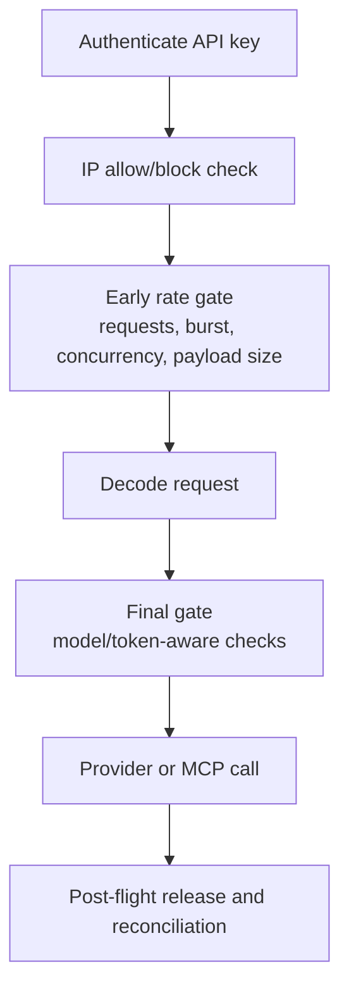

# Key policies

Key policies are request controls attached to a virtual API key. They protect a key from being used outside its expected network, traffic pattern, or payload envelope see [Guardrails](/docs/security-and-guardrails/guardrails) for more details.

They are not content moderation rules. Prompt safety and response safety are covered by [SafetySec Engine](/docs/security-and-guardrails/safetysec-engine).

## Available Policy Groups

| Policy group | Fields | What it does |
| --- | --- | --- |
| IP rules | Allowlist, blocklist | Restricts which client IPs can use the key. |
| Request rate | Burst, requests per minute, requests per second | Limits short-term request frequency. |
| Token rate | Tokens per minute | Reserves estimated tokens and blocks excessive token volume. |
| Payload | Max tokens, max request bytes | Blocks oversized requests before provider execution. |
| Concurrency | Max concurrent requests, lease TTL | Limits in-flight requests using the key. |

## Where Policies Run

Fast checks run early so invalid traffic is rejected before expensive work. Checks that require the decoded request, such as model or token estimates, run later.

## Practical Policy Patterns

Use IP allowlists for production services with stable egress IPs.

Use request limits for public-facing apps or scheduled jobs that could accidentally loop.

Use payload limits to prevent very large prompts or file-like payloads from reaching providers.

Use concurrency limits for batch jobs and agent systems that can fan out too aggressively.
