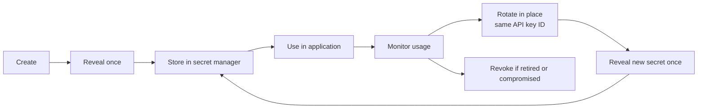

# Lifecycle and rotation

Virtual API keys should be treated as secrets. Use a lifecycle that supports one-time reveal, in-place rotation, emergency revocation, rotation history, and usage review.

## Reveal

API keys are reveal-once secrets. Reveal is intended for initial setup or controlled recovery. The table and detail page show whether a key has already been revealed.

After a key has been revealed, later reads return only a masked value. If you cannot safely recover the full key value, rotate it.

## Rotate

Rotation generates a new secret value on the same API key record. The API key ID does not change.

This means the rotated key keeps:

- model access,
- MCP access,
- routing policies,
- budgets and quotas,
- usage attribution,
- detail page links and references.

Use rotation when:

- a key may be exposed,
- a deployment owner changes,
- a key was copied into an unsafe place,
- a key expired and should be renewed,
- your security process requires periodic credential rotation.

During rotation, choose a new expiry. Use a future date for a time-limited key or leave expiry empty for no expiry. Past expiry values are rejected.

After rotation, update the application secret and redeploy the application. The previous secret stops authenticating after gateway cache invalidation or cache expiry.

## Rotation History

Each rotation creates a Rotation History entry with:

- rotation date,
- masked previous key value,
- previous expiry,
- new expiry,
- user that rotated the key.

Previous key values are sensitive. The UI returns masked previous values for review.

## Revoke

Revocation disables an API key without changing its secret value. The gateway rejects future requests when the key is revoked.

Use revocation when:

- an application is retired,
- the key is compromised,
- a test key should no longer work,
- an owner leaves the organisation or team.

Revoked keys are not offered as rotation candidates in the table UI. If the UI offers **Unrevoke**, use it only when the key value is still controlled and safe.

## Monitor After Changes

After any rotation or revocation, open **Usage Records** and filter by API key. Because rotation keeps the same API key ID, traffic attribution remains on the same key. Confirm that application traffic continues after rotation and stops after revocation.

Also review **Rotation History** after rotation to confirm the previous expiry, new expiry, rotating user, and rotation date.
