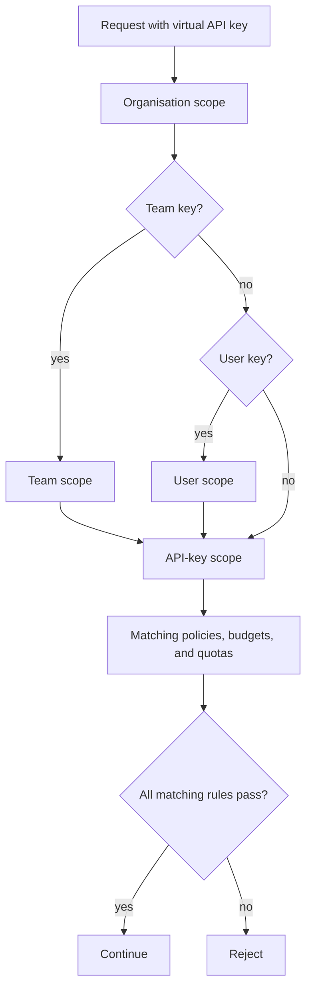

# Scope and principals

The virtual API key is the runtime identity. Its type builds the principal chain used for attribution and enforcement.

| Key type | Principal chain | Use it for |
| --- | --- | --- |
| `ORGANISATION` | Organisation -> API key | Shared backend services and central integrations. |
| `TEAM` | Organisation -> Team -> API key | Team-owned applications, agents, or workflows. |
| `USER` | Organisation -> User -> API key | Personal automation, notebooks, prototypes, and user-owned jobs. |

Scope affects who owns usage, which budgets and quotas match, and which scoped policies apply. Scope does not grant model or MCP access by itself.

## Inheritance

The gateway checks every active rule that matches the principal chain.

For example, a team-scoped key can be blocked by an organisation monthly budget, a team weekly token quota, or the API key's daily cost budget.

## Choosing The Right Scope

Use organisation keys when the service is shared and should not be attributed to a single team or user.

Use team keys when the owning group is stable and budget or quota accountability should follow that team.

Use user keys for personal experiments or workflows where usage should be attributed to one person.

## Common Mistakes

| Symptom | Cause | Fix |
| --- | --- | --- |
| Key exists but model call is forbidden | Scope does not create access grants. | Add Model Access for the key. |
| Team budget is not used | The key is organisation-scoped, not team-scoped. | Use a team-scoped key for team-owned traffic. |
| Usage is not attributed to a user | The key is not user-scoped. | Create a user-scoped key for personal workflows. |
| A request is blocked unexpectedly | A broader organisation or team rule applies. | Check all matching budgets, quotas, and policies. |
