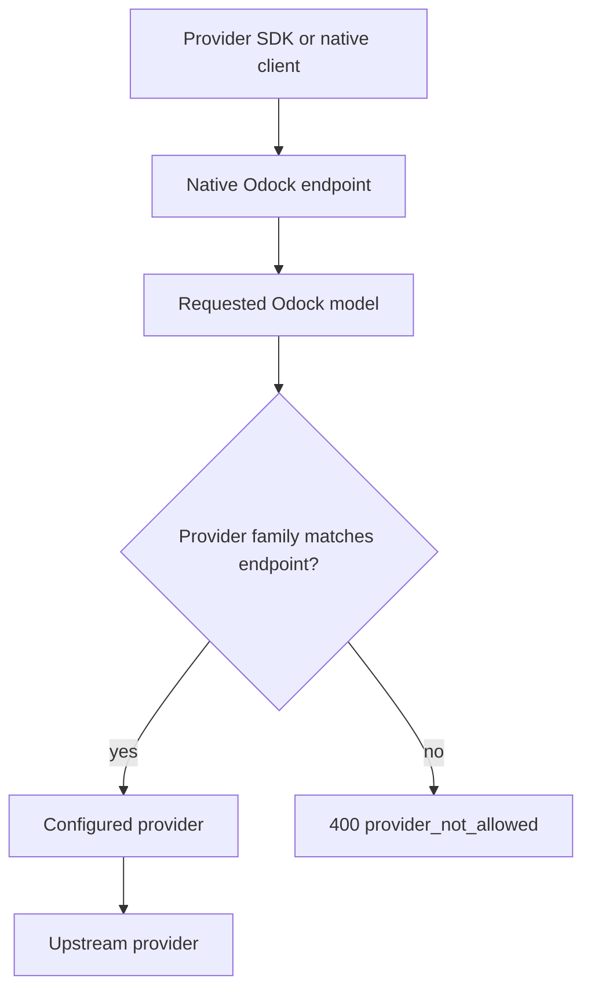
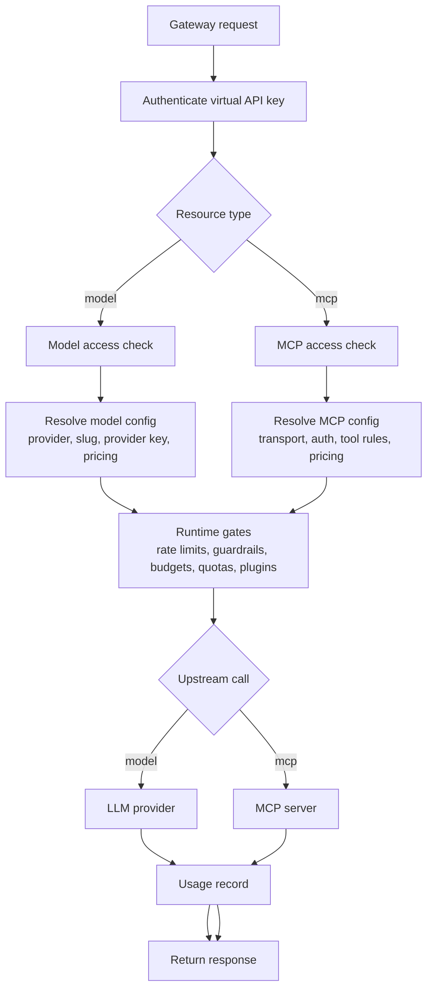
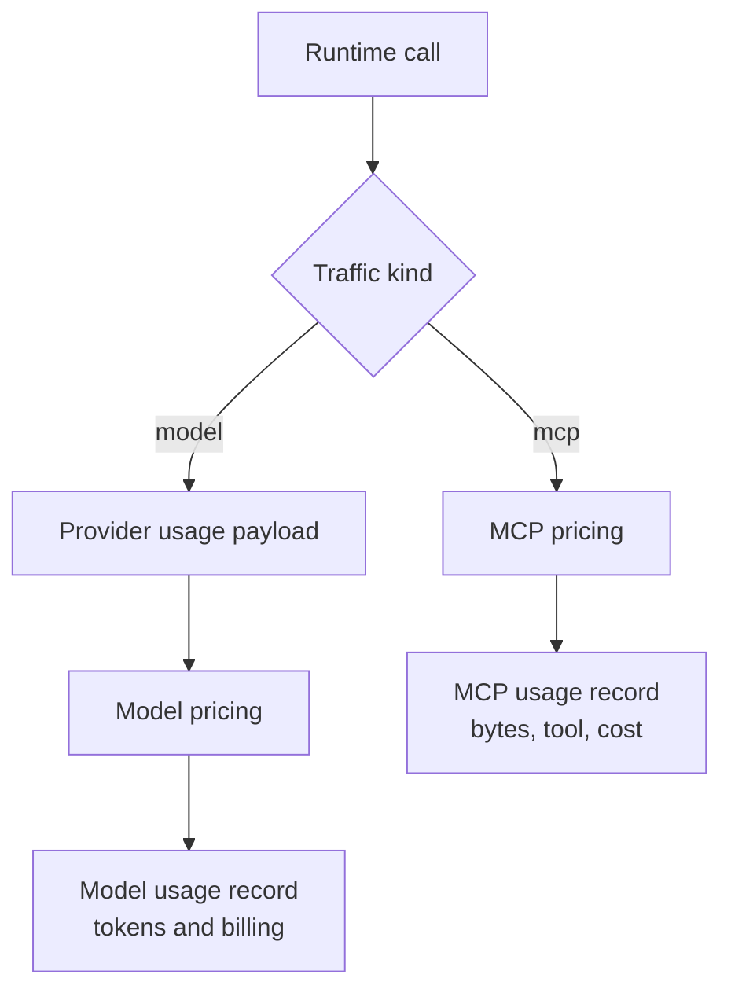

# Endpoints

Endpoints are the gateway HTTP surfaces that applications call with a virtual API key. The endpoint determines the request and response shape. The model or MCP server configuration determines where the request is sent after Odock applies governance.

For complete API examples, see [Usage](/docs/usage), [Native Models call](/docs/usage/native-models-call), and [Unified Multi Model Endpoint call](/docs/usage/unified-multi-model-endpoint-call).

## Endpoint Families

| Family | Use when | Example |
| --- | --- | --- |
| Native provider endpoints | You want SDK compatibility with a provider family. | OpenAI-compatible `/v1/chat/completions`, Anthropic-compatible `/v1/messages`, Gemini-compatible `/v1beta/models/{model}:generateContent`, vLLM-compatible `/v1/vllm/...`. |
| Unified multi-model endpoint | You want a provider-neutral Odock chat endpoint and optional routing across configured models. | `/v1/llm/chat`. |
| MCP endpoint | You want to proxy MCP tool traffic through Odock governance. | `/v1/mcp/{slug}` or `/v1/mcp/{id}`. |

All runtime calls use a virtual API key created in Odock, not an upstream provider key.

## Native Provider Endpoints

Native endpoints keep the provider's familiar request and response shape. This is useful when an application already uses a provider SDK.

| Provider family | Example endpoint | Notes |
| --- | --- | --- |
| OpenAI-compatible | `/v1/chat/completions`, `/v1/responses`, `/v1/embeddings`, `/v1/images/generations` | Set the OpenAI SDK base URL to the Odock gateway `/v1` URL. |
| Anthropic-compatible | `/v1/messages` | Use the Odock gateway root expected by the Anthropic client. |
| Gemini-compatible | `/v1beta/models/{model}:generateContent` | The `{model}` path segment is the Odock model name. |
| vLLM-compatible | `/v1/vllm/chat/completions`, `/v1/vllm/embeddings`, and other vLLM paths | Use models configured with a vLLM provider. |

Native endpoints are provider-family aware. If an OpenAI-compatible endpoint receives a model configured for another provider family, Odock can reject the request because that endpoint cannot safely transform the request to the wrong provider shape.



## Unified Multi-Model Endpoint

Use `/v1/llm/chat` when you want a provider-neutral endpoint for chat-style requests.

The unified endpoint accepts OpenAI-compatible chat fields such as `model`, `messages`, `temperature`, `max_tokens`, `tools`, `tool_choice`, `response_format`, and `stream`.

When routing is enabled, the gateway can evaluate routing candidates across configured models and providers, as long as the virtual API key has access to those models.

For routing setup, see [Routing](/docs/management/routing).

## MCP Endpoint

MCP calls use:

```txt
/v1/mcp/{slug}
/v1/mcp/{id}
/v1/mcp/{slug}/{path}
```

The slug or id resolves to an MCP server record. Odock authenticates the virtual API key, loads the MCP server, checks access, applies scope and guardrails, proxies to `STREAMABLE_HTTP`, `SSE`, or `STDIO`, and records MCP usage.

For setup, see [MCP Servers](/docs/models-and-mcp/mcp-servers).

## Runtime Lifecycle

The exact lifecycle differs slightly between LLM and MCP traffic, but the same principles apply: authenticate, authorize, govern, call upstream, and record usage.



## Model Request Checklist

- The provider exists and is enabled.
- The provider has a valid provider key.
- The model exists in Odock.
- The model points to the correct provider and provider key.
- The client sends the Odock model name.
- The virtual API key is active and not expired or revoked.
- The virtual API key has Model Access for that model.
- Applicable policies, budgets, quotas, guardrails, and routing rules allow the request.

## MCP Request Checklist

- The MCP server exists and is enabled.
- The client calls the correct MCP slug or id.
- The virtual API key is active and not expired or revoked.
- The virtual API key has MCP Access for that server.
- Team Scope or API Key Scope matches when configured.
- The requested tool is allowed and not blocked.
- Auth config is valid for the upstream MCP server.
- Applicable policies, budgets, quotas, and guardrails allow the request.

## Endpoint Workflows

- [Test a model from the Playground](/docs/models-and-mcp/endpoints/test-model-from-playground)
- [Test through an application request](/docs/models-and-mcp/endpoints/test-application-request)
- [Test an MCP call](/docs/models-and-mcp/endpoints/test-mcp-call)

## Pricing And Usage Calculation

For model calls, Odock reads the provider usage payload when available, normalizes token categories, and applies model pricing. Usage records store both the normalized token breakdown and the raw provider usage payload.

For MCP calls, Odock estimates cost from call count and input/output byte counts using the MCP server pricing.



For billing views, see [Invoices](/docs/tools/invoices). For monitoring, see [Usage Monitoring](/docs/observability/usage-monitoring).

## Common Errors

| Error or symptom | Likely cause |
| --- | --- |
| `401 Unauthorized` | Missing or invalid virtual API key. |
| `403 Forbidden` | The virtual API key exists but lacks access or is blocked by policy. |
| `model not found` | The request uses a model name not configured in Odock. |
| `provider_not_allowed` | The endpoint family does not match the configured model provider. |
| `mcp_not_found` | The MCP slug or id does not match a configured MCP server. |
| `mcp_not_allowed` | The API key does not have MCP Access for the server. |
| `mcp_guardrail_block` | Tool allow/block rules or semantic filters denied the call. |
| `budget_exceeded` | An active budget does not have enough remaining capacity. |
| `quota_exceeded` | An active quota limit was reached. |

For the full error reference, see [Gateway Errors](/docs/usage/errors).
