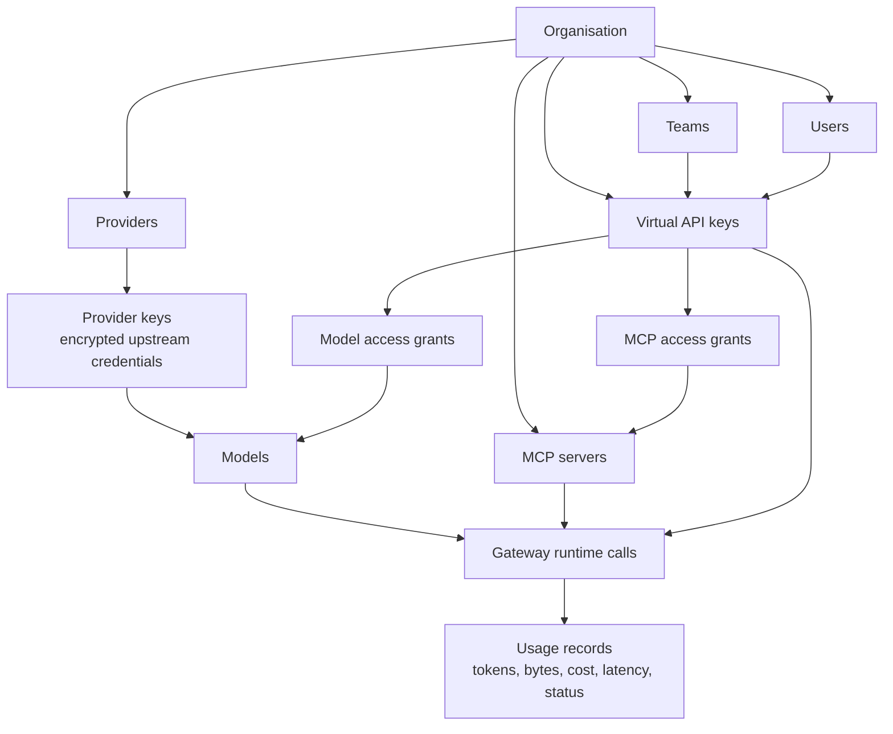
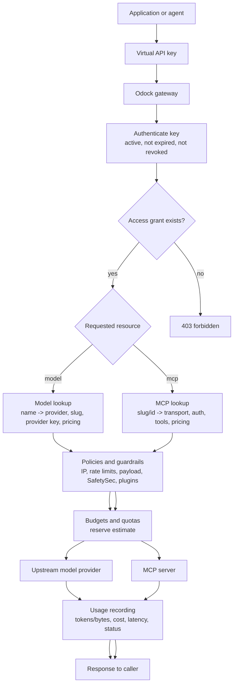

# Models & MCP

Models and MCP servers are the resources your applications can use through Odock.

A model is an LLM, embedding model, image model, audio model, or similar AI model that is backed by an upstream provider. An MCP server is a tool server exposed through the Model Context Protocol and governed by Odock before traffic reaches the tool runtime.

## Why This Matters

Without a gateway, each application usually needs its own provider credentials, tool endpoints, pricing assumptions, and policy logic. That is hard to audit and harder to change safely.

With Odock:

- Applications call one gateway with a virtual API key.
- Provider secrets stay in Odock, not in application code.
- Each virtual API key gets explicit model and MCP access grants.
- Policies, budgets, quotas, routing, guardrails, and usage records are applied consistently.
- Usage records show who called what, which provider or MCP server was used, how much it cost, and whether the request succeeded.

For the API key concept, see [Virtual API Keys](/docs/management/virtual-api-keys). For policy and safety behavior, see [Guardrails](/docs/security-and-guardrails/guardrails). For cost controls, see [Budgets](/docs/management/budgets) and [Quotas](/docs/management/quotas).

## Core Hierarchy

Models and MCP servers live inside an organisation. API keys also live inside the organisation, and can be organisation-scoped, team-scoped, or user-scoped. Runtime access is not inherited automatically from being a member of a team or organisation. Access is granted explicitly to the API key that will make the gateway call.

The practical rule is simple: create or import the resource, configure its cost and governance, then grant access to the virtual API key that will use it.

## Provider, Model, MCP, API Key

These four concepts are related, but they are not interchangeable.

| Concept | What it is | Used by the gateway for |
| --- | --- | --- |
| Provider | The upstream AI service connection, such as OpenAI, Anthropic, Google, Azure OpenAI, vLLM, Mistral, or a custom-compatible provider. | Selecting the upstream API family, base URL, timeout, and provider implementation. |
| Provider key | The upstream secret for a provider. | Authenticating from Odock to the upstream provider. It is not given to applications. |
| Model | The organisation model record that clients request by name. | Resolving the requested model to a provider, upstream slug, provider key, capabilities, pricing, and policies. |
| MCP server | A governed tool server exposed through `/v1/mcp/{slug}` or `/v1/mcp/{id}`. | Resolving tool traffic to a transport, auth config, tool allow/block rules, pricing, and policies. |
| Virtual API key | The Odock credential used by applications. | Authenticating the caller, applying scope, checking model/MCP grants, attributing usage, and enforcing budgets or quotas. |

## Scoped Access

There are two forms of scope you will see in the UI.

First, a virtual API key has an owner scope:

- `ORGANISATION`: for shared services used across the organisation.
- `TEAM`: for a team-owned app, workflow, or agent.
- `USER`: for personal experiments or user-owned automation.

Second, a model or MCP server can have resource-level configuration:

- Models belong to an organisation and can have policies and pricing.
- MCP servers belong to an organisation and may also be narrowed with a Team Scope or API Key Scope.
- Access grants decide which virtual API keys can call the resource at runtime.

For most user workflows, use access grants as the main runtime boundary. Use team or API-key scoping on MCP servers when the server itself should only be visible or usable in a narrower context.

## Runtime Flow

When an application calls the gateway, Odock combines the model or MCP configuration with the API key context.

For LLM traffic, Odock resolves the requested model name to the configured model record. That record tells the gateway which provider to use, which upstream model slug to send, which provider key to decrypt in memory, what pricing applies, and which resource policies exist.

For MCP traffic, Odock resolves the slug or id, checks `MCP Access`, applies tool allow/block rules and semantic filters, proxies to the configured transport, and records MCP-specific usage such as method, tool name, input bytes, output bytes, latency, and cost.

## What Users Configure

The organisation UI exposes the workflows you need:

- **Providers**: activate and configure upstream provider connections.
- **Provider detail**: add provider keys and create models bound to that provider.
- **Models & MCP Servers**: list and open configured models.
- **MCP Servers**: list and open configured MCP servers.
- **API Keys**: grant model and MCP access, configure key-level policies, routing, budgets, quotas, and review usage.
- **Usage Records**: inspect model and MCP traffic after calls run.
- **AI Playground**: test configured models from the UI before using them in applications.

## Recommended Setup Order

Use this order when bringing a new model or MCP server into production.

<Steps>

<Step>
Activate or create the provider.
</Step>

<Step>
Add the provider key.
</Step>

<Step>
Add models manually or from the model catalog.
</Step>

<Step>
Review or edit model pricing and policies.
</Step>

<Step>
Add MCP servers manually or from the trusted MCP catalog.
</Step>

<Step>
Review MCP transport, auth, governance, pricing, and policies.
</Step>

<Step>
Create or open the virtual API key that will call the resources.
</Step>

<Step>
Grant model access and MCP access.
</Step>

<Step>
Add budgets, quotas, or routing policies if needed.
</Step>

<Step>
Test through the AI Playground or through a gateway request.
</Step>

<Step>
Review usage records to confirm provider, model, MCP server, tokens, bytes, cost, latency, status, and routing metadata.
</Step>

</Steps>

## Runtime Configuration Refresh

Odock stores configuration in Postgres. The gateway keeps frequently used runtime information in Redis and short-lived in-process caches for speed. When you edit a runtime-sensitive resource in the UI, cache invalidation tells gateway instances to reload fresh configuration on the next matching request.

This means changes such as model pricing, provider keys, model access, MCP access, API key revocation, or MCP server configuration should take effect without restarting the gateway.

For the larger management/runtime architecture, see [Architecture](/docs/getting-started/architecture).

## Where To Go Next

Read the pages in this section in order if you are setting up from scratch:

- [Providers](/docs/models-and-mcp/providers): connect upstream AI providers and provider keys.
- [Models](/docs/models-and-mcp/models): create model records, configure capabilities, pricing, policies, and access.
- [Add a variant model](/docs/models-and-mcp/models/add-variant-model): create a client or project-specific Odock model name, such as `gpt-4.1-clientA`, that points to an existing upstream slug.
- [MCP Servers](/docs/models-and-mcp/mcp-servers): add tool servers, configure transport/auth/governance, pricing, and access.
- [Endpoints](/docs/models-and-mcp/endpoints): understand how applications call models and MCP servers through the gateway.
