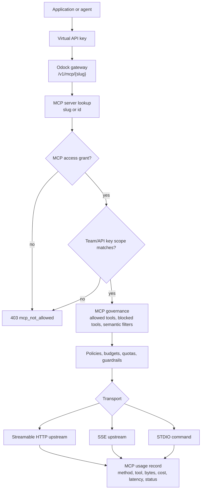
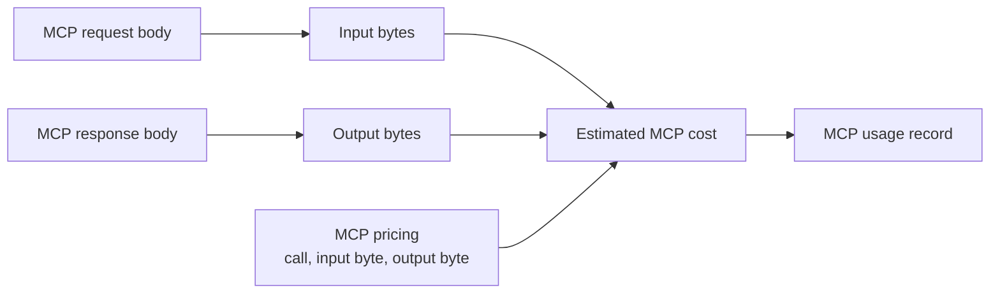

# MCP Servers

MCP servers expose tools that agents and applications can call through the Model Context Protocol. Odock lets you govern MCP traffic the same way you govern model traffic: explicit API key access, scoped ownership, policies, pricing, budgets, quotas, guardrails, and usage records.

An MCP server record tells Odock how to reach the tool server, how to authenticate upstream, which tools are allowed or blocked, how to price usage, and which virtual API keys can call it.

## MCP Runtime Model



MCP calls use the configured MCP server slug or id, not a model name. The common runtime path is:

```txt
/v1/mcp/{slug}
/v1/mcp/{id}
/v1/mcp/{slug}/{path}
```

For endpoint details, see [Endpoints](/docs/models-and-mcp/endpoints).

## Transport Types

| Transport | Use when | Required setup |
| --- | --- | --- |
| `STREAMABLE_HTTP` | The MCP server exposes an HTTP endpoint that supports streamable MCP traffic. | Endpoint URL. |
| `SSE` | The MCP server streams responses using server-sent events. | Endpoint URL. |
| `STDIO` | Odock should launch a local command and communicate over standard input/output. | Command, args, and optional environment JSON. |

Choose the transport that matches how the MCP server runs. For production, prefer a stable HTTP or SSE service when possible. Use STDIO for local or packaged tool servers that are meant to be launched by the gateway environment.

## Auth Types

MCP upstream auth can be `NONE`, `BEARER`, `BASIC`, or `OAUTH2`.

Auth config is stored on the MCP server record and used when Odock proxies to the upstream MCP server. A virtual API key authenticates the caller to Odock; MCP auth authenticates Odock to the MCP server.

## Scope And Access

MCP has two related controls.

First, an MCP server can be narrowed by Team Scope or API Key Scope. Second, runtime calls require an explicit `MCP Access` grant for the virtual API key.

Use access grants for normal permissioning. Use Team Scope or API Key Scope when the MCP server itself should be restricted to a specific team or key context.

## MCP Governance

| Control | What it does |
| --- | --- |
| Allowed tools | If set, only listed tool names are allowed for `tools/call`. |
| Blocked tools | Listed tool names are denied for `tools/call`. |
| Semantic filter | JSON configuration for blocking configured keywords or patterns in MCP payloads. |
| Policies | IP and rate limits applied to this MCP server. |
| Budgets and quotas | Cost and usage controls applied in the runtime flow. |

Allowed and blocked tools are useful when a server exposes both read-only and write-capable tools. For example, you might allow `search` and `open` while blocking a destructive repository operation.

For broader guardrail behavior, see [Guardrails](/docs/security-and-guardrails/guardrails).

## MCP Pricing

MCP pricing estimates cost from calls and bytes. The UI accepts price in USD per 1M calls, input price in USD per 1M bytes, and output price in USD per 1M bytes.

Internally, pricing is stored in nanos USD per call or byte.



MCP usage records include the pricing snapshot so later reporting can explain how the cost was calculated.

## MCP Workflows

- [Add MCP servers from the trusted catalog](/docs/models-and-mcp/mcp-servers/add-from-trusted-catalog)
- [Add an MCP server manually](/docs/models-and-mcp/mcp-servers/add-manually)
- [Review MCP transport](/docs/models-and-mcp/mcp-servers/review-transport)
- [Review MCP security and access settings](/docs/models-and-mcp/mcp-servers/review-security-access)
- [Edit MCP governance](/docs/models-and-mcp/mcp-servers/edit-governance)
- [Edit MCP pricing](/docs/models-and-mcp/mcp-servers/edit-pricing)
- [Update MCP pricing from the catalog](/docs/models-and-mcp/mcp-servers/update-pricing-from-catalog)
- [Grant MCP access to an API key](/docs/models-and-mcp/mcp-servers/grant-mcp-to-api-key)
- [Grant API keys to an MCP server](/docs/models-and-mcp/mcp-servers/grant-api-keys-to-mcp-server)

## Usage Records

MCP usage records show MCP server id and slug, transport, HTTP or RPC method, tool name for `tools/call`, status, latency, input bytes, output bytes, pricing snapshot, total cost, and API key, organisation, team, and user attribution when available.

Use these records to review tool adoption, detect expensive tool calls, investigate blocked calls, and reconcile MCP costs.

## Troubleshooting

| Symptom | What to check |
| --- | --- |
| `mcp_not_found` | Confirm the client is using the MCP server slug or id from Odock. |
| `mcp_not_allowed` | Confirm the virtual API key has an MCP Access grant. |
| `mcp_guardrail_block` | Check allowed tools, blocked tools, and semantic filters. |
| Upstream auth error | Review MCP Auth Type and Auth Config. |
| Missing endpoint error | Confirm Endpoint URL for HTTP/SSE or STDIO command for STDIO. |
| No MCP cost | Confirm MCP Pricing is configured. |
| Calls do not appear in usage | Confirm traffic is going through `/v1/mcp/{slug}` on the Odock gateway. |

Continue with [Endpoints](/docs/models-and-mcp/endpoints) to see how applications call models and MCP servers.
