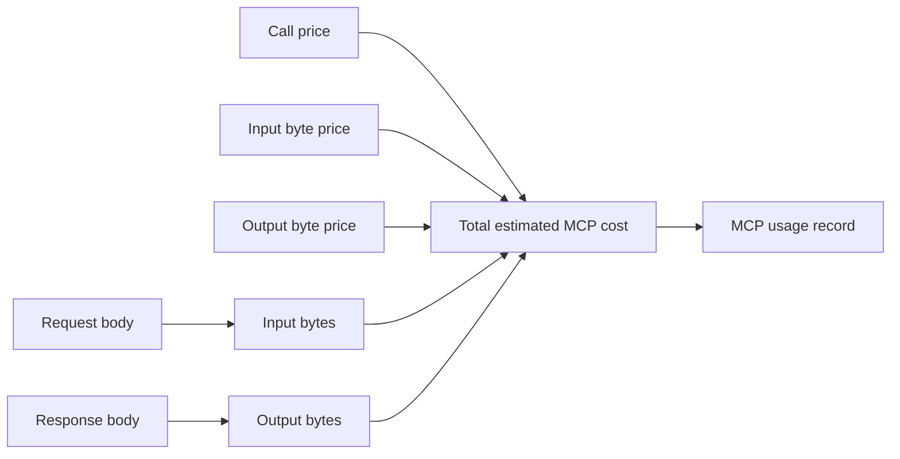

# MCP Pricing

MCP pricing estimates the cost of tool traffic. Unlike model pricing, MCP pricing is based on calls and bytes rather than tokens.

The UI accepts human-readable values:

- USD per 1M calls
- USD per 1M input bytes
- USD per 1M output bytes

Odock stores the values internally as nanos USD per call or byte, then uses them to estimate each MCP request.

## Pricing Fields

| UI field | Internal field | Meaning |
| --- | --- | --- |
| Price (USD / 1M calls) | `callNanosUsd` | Flat cost for each MCP request. |
| Input price (USD / 1M bytes) | `inputByteNanosUsd` | Cost for bytes sent from the caller to the MCP server. |
| Output price (USD / 1M bytes) | `outputByteNanosUsd` | Cost for bytes returned by the MCP server. |

## Cost Formula

```txt
estimated cost =
  flat call cost
  + input byte cost
  + output byte cost
```



## Example

Assume an MCP server has:

| Field | Value |
| --- | --- |
| Price per 1M calls | `$2.00` |
| Input price per 1M bytes | `$0.50` |
| Output price per 1M bytes | `$1.00` |

For one call with 2,000 input bytes and 8,000 output bytes:

```txt
call cost   = 2.00 / 1,000,000 = $0.000002
input cost  = 0.50 * 2,000 / 1,000,000 = $0.000001
output cost = 1.00 * 8,000 / 1,000,000 = $0.000008
total       = $0.000011
```

## What Usage Records Store

MCP usage records include:

- MCP server id
- transport
- method
- tool name
- input bytes
- output bytes
- pricing snapshot
- total cost in nanos USD
- status and latency

The pricing snapshot matters because future pricing changes should not rewrite historical usage cost.

## Pricing Strategy

Use different MCP pricing when:

- A tool calls a paid external API.
- A tool performs expensive internal work.
- A client contract needs tool-specific chargeback.
- A team needs cost visibility even when tools do not use model tokens.

For UI steps, see [Edit MCP pricing](/docs/models-and-mcp/mcp-servers/edit-pricing).

To review the pricing for an MCP call see [MCP Usage Records](/docs/observability/usage-records/mcp-usage-records).
