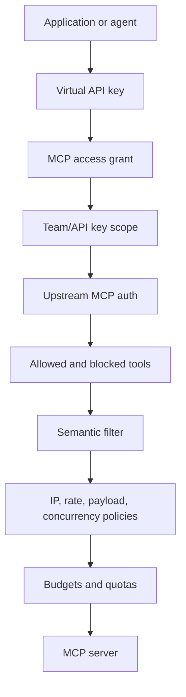

# MCP Security

MCP servers expose tools. Some tools are read-only, but others can write files, open network connections, modify repositories, call paid APIs, or access sensitive systems. Treat MCP access as runtime capability access, not just a convenience feature.

Odock secures MCP traffic through layered controls.

## Security Layers



A request must pass the applicable layers before the upstream MCP server receives it.

## Access Grants

An MCP server existing in the organisation does not make it callable. The virtual API key must have an `MCP Access` grant for that server.

Use grants to control which applications or agents can call the server.

For grant steps, see [Grant MCP access to an API key](/docs/models-and-mcp/mcp-servers/grant-mcp-to-api-key) and [Grant API keys to an MCP server](/docs/models-and-mcp/mcp-servers/grant-api-keys-to-mcp-server).

## Team And API Key Scope

MCP servers can also be narrowed with Team Scope or API Key Scope.

| Scope | Effect |
| --- | --- |
| No extra scope | Any granted API key in the organisation can call the server. |
| Team Scope | The server is intended for a specific team context. |
| API Key Scope | The server is intended for one specific API key context. |

Use scope when the server itself should be restricted, not only the access grant.

## Tool Rules

Tool rules apply to JSON-RPC `tools/call` requests.

| Rule | Behavior |
| --- | --- |
| Allowed Tools | If the list is not empty, Odock allows only tools in the list. |
| Blocked Tools | Odock blocks listed tools. |

If a tool appears in the blocked list, it should be treated as unavailable even if the server exposes it.

Example:

```txt
Allowed Tools: search,open
Blocked Tools: delete_repo,write_file
```

## Semantic Filter

Semantic filter JSON can block configured keywords or patterns in MCP payloads. The current simple shape is:

```json
{
  "blockedKeywords": ["secret", "private key", "production token"]
}
```

If a blocked keyword appears in the MCP request body, Odock denies the request with an MCP guardrail block.

Use semantic filters as a narrow guardrail. Do not rely on them as the only protection for sensitive tools. Combine them with access grants, tool rules, policies, and upstream permissions.

## Policies

MCP policies can include:

- IP allowlist
- IP blocklist
- request limits
- payload limits
- concurrency limits

For broader policy layering, see [Guardrails](/docs/security-and-guardrails/guardrails).

## Transport-Specific Security

| Transport | Main security concern |
| --- | --- |
| `STREAMABLE_HTTP` | Protect the upstream endpoint and configure upstream auth. |
| `SSE` | Watch long-lived streams, timeouts, and output volume. |
| `STDIO` | The command runs in the gateway environment, so only use trusted commands and minimal environment variables. |

For transport details, see [Streamable HTTP transport](/docs/models-and-mcp/mcp-servers/streamable-http-transport), [SSE transport](/docs/models-and-mcp/mcp-servers/sse-transport), and [STDIO transport](/docs/models-and-mcp/mcp-servers/stdio-transport).

## Practical Checklist

- Grant MCP access only to API keys that need the tool server.
- Use allowed tools for read-only or approved tools.
- Block destructive tools explicitly.
- Store upstream auth in Odock, not in application code.
- Set pricing so expensive tool usage is visible.
- Add budgets or quotas for high-cost tools.
- Prefer HTTP/SSE for production services that need isolation.
- Use STDIO only for trusted commands in controlled gateway environments.
