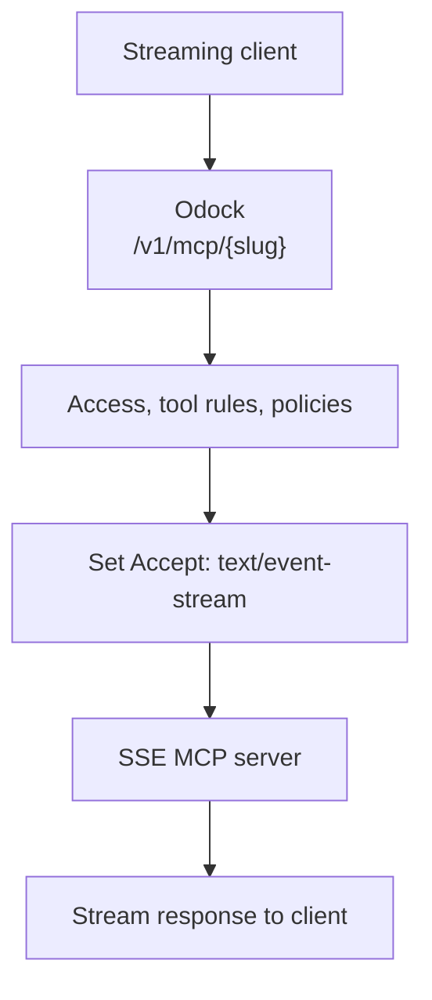

# SSE transport

Use `SSE` when the upstream MCP server streams responses using server-sent events.

In this mode, Odock still receives traffic at `/v1/mcp/{slug}`. When proxying upstream, it sets `Accept: text/event-stream` and streams the upstream response back to the caller.

## When To Use It

Use SSE when:

- The upstream MCP server returns streaming events.
- The client expects incremental tool or protocol events.
- The server exposes an HTTP endpoint but needs `Accept: text/event-stream`.

Use `STREAMABLE_HTTP` instead when the server responds with normal JSON and does not require SSE semantics.

## Required Fields

| Field | Value |
| --- | --- |
| Transport | `SSE` |
| Endpoint URL | The upstream SSE-capable MCP endpoint |
| Auth Type | `NONE`, `BEARER`, `BASIC`, or `OAUTH2` |
| Enabled | On for runtime use |

## Runtime Flow



## Example Configuration

| UI field | Example |
| --- | --- |
| Name | `Realtime Research MCP` |
| Slug | `realtime-research` |
| Transport | `SSE` |
| Endpoint URL | `https://research-tools.example.com/sse` |
| Auth Type | `OAUTH2` |
| Auth Config | `{"tokenUrl":"https://auth.example.com/oauth/token","clientId":"odock","clientSecret":"secret","scope":"mcp:tools"}` |

For OAuth2 details, see [MCP authentication](/docs/models-and-mcp/mcp-servers/authentication).

## Example Request

```bash
curl -N "$ODOCK_GATEWAY_URL/v1/mcp/realtime-research" \
  -H "Authorization: Bearer $ODOCK_API_KEY" \
  -H "Content-Type: application/json" \
  -d '{
    "jsonrpc": "2.0",
    "id": "call-1",
    "method": "tools/call",
    "params": {
      "name": "research_stream",
      "arguments": {
        "topic": "quarterly product feedback"
      }
    }
  }'
```

## Operational Notes

- Streaming responses can stay open longer than unary responses. Configure upstream timeouts and budgets accordingly.
- Usage records still capture method, tool name, status, latency, input bytes, output bytes, and estimated cost.
- SSE is best for remote services. For local command-based MCP servers, use [STDIO transport](/docs/models-and-mcp/mcp-servers/stdio-transport).
