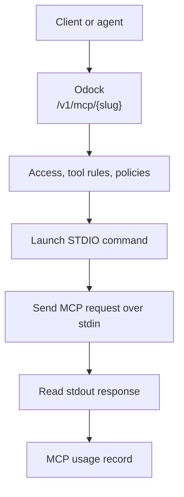

# STDIO transport

Use `STDIO` when Odock should launch a local command and communicate with it through standard input and output.

This transport is useful for packaged MCP servers that are designed to run as commands, such as Node packages launched with `npx`. The command runs in the gateway environment, so it must be installed or downloadable there.

## When To Use It

Use STDIO when:

- The MCP server is distributed as a command-line package.
- The server is intended to speak MCP over stdin/stdout.
- The command can run safely in the Odock gateway environment.
- You need local environment variables for the tool server.

Use HTTP or SSE instead when the MCP server is already deployed as a service.

## Required Fields

| Field | Value |
| --- | --- |
| Transport | `STDIO` |
| STDIO Command | Command to run, for example `npx` |
| STDIO Args | Arguments, for example `-y,@modelcontextprotocol/server-sequential-thinking` |
| STDIO Env | Optional JSON object of environment variables |
| Enabled | On for runtime use |

## Runtime Flow



Odock sends framed MCP input with a `Content-Length` header. If a server returns an empty response, Odock also has compatibility behavior for newline-delimited JSON. If the command fails, Odock returns an MCP STDIO gateway error.

## Example Configuration

| UI field | Example |
| --- | --- |
| Name | `Sequential Thinking` |
| Slug | `sequential-thinking` |
| Transport | `STDIO` |
| STDIO Command | `npx` |
| STDIO Args | `-y,@modelcontextprotocol/server-sequential-thinking` |
| STDIO Env | `{}` |
| Auth Type | `NONE` |
| Allowed Tools | `sequentialthinking` |

## Example Request

```bash
curl "$ODOCK_GATEWAY_URL/v1/mcp/sequential-thinking" \
  -H "Authorization: Bearer $ODOCK_API_KEY" \
  -H "Content-Type: application/json" \
  -d '{
    "jsonrpc": "2.0",
    "id": "call-1",
    "method": "tools/call",
    "params": {
      "name": "sequentialthinking",
      "arguments": {
        "thought": "Break down the release checklist",
        "nextThoughtNeeded": true,
        "thoughtNumber": 1,
        "totalThoughts": 3
      }
    }
  }'
```

## Security Notes

STDIO commands run where the gateway runs. Treat them as executable code:

- Only use trusted MCP packages or internal commands.
- Pin package versions when possible.
- Keep environment variables minimal.
- Avoid broad filesystem or network access for command-based tools.
- Prefer HTTP/SSE for shared production tools that need independent isolation.

For broader controls, see [MCP security](/docs/models-and-mcp/mcp-servers/security).
