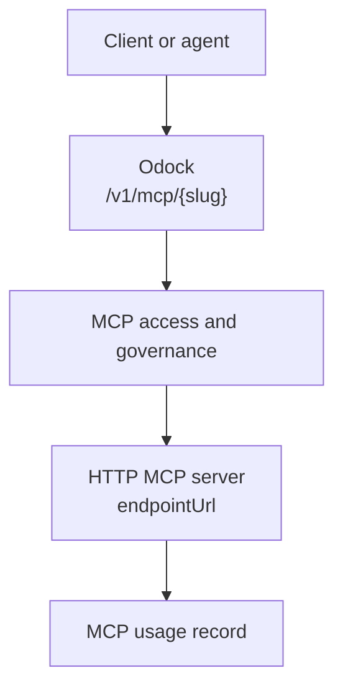

# Streamable HTTP transport

Use `STREAMABLE_HTTP` when the MCP server exposes an HTTP endpoint that can receive MCP JSON-RPC requests over normal HTTP.

This is the most common production-friendly transport because the MCP server runs as its own service. Odock receives client traffic at `/v1/mcp/{slug}`, applies governance, and forwards the request body to the configured upstream endpoint URL.

## When To Use It

Use Streamable HTTP when:

- The MCP server is deployed as a web service.
- You want independent scaling, logging, and deployment for the MCP server.
- The server can be reached from the Odock gateway environment.
- You need normal HTTP authentication such as bearer, basic, or OAuth2 client credentials.

## Required Fields

| Field | Value |
| --- | --- |
| Transport | `STREAMABLE_HTTP` |
| Endpoint URL | The upstream MCP HTTP endpoint, for example `https://tools.example.com/mcp` |
| Auth Type | `NONE`, `BEARER`, `BASIC`, or `OAUTH2` |
| Enabled | On for runtime use |

For auth config details, see [MCP authentication](/docs/models-and-mcp/mcp-servers/authentication).

## Runtime Flow



Odock forwards most request headers but does not forward the caller's `Authorization`, `x-api-key`, `Host`, or `Content-Length` headers to the upstream MCP server. Odock applies the configured MCP upstream auth instead.

## Example Configuration

| UI field | Example |
| --- | --- |
| Name | `Search Tools` |
| Slug | `search-tools` |
| Transport | `STREAMABLE_HTTP` |
| Endpoint URL | `https://tools.example.com/mcp` |
| Auth Type | `BEARER` |
| Auth Config | `{"token":"upstream-tool-token"}` |
| Allowed Tools | `search,open` |
| Blocked Tools | `delete,write` |

## Example Request

The application calls Odock, not the upstream MCP server directly.

```bash
curl "$ODOCK_GATEWAY_URL/v1/mcp/search-tools" \
  -H "Authorization: Bearer $ODOCK_API_KEY" \
  -H "Content-Type: application/json" \
  -d '{
    "jsonrpc": "2.0",
    "id": "call-1",
    "method": "tools/call",
    "params": {
      "name": "search",
      "arguments": {
        "query": "latest internal deployment notes"
      }
    }
  }'
```

Odock checks the virtual API key, verifies MCP access, checks the tool rules, applies policies and budgets, forwards to `https://tools.example.com/mcp`, and records the usage.

## Operational Notes

- Keep the endpoint URL stable. Changing it affects all API keys that use this MCP server.
- Use `Allowed Tools` when the server exposes a broad tool set and only some tools are approved for the project.
- If the server requires authentication, configure upstream auth on the MCP server record rather than forwarding caller credentials.
- Use [MCP pricing](/docs/models-and-mcp/mcp-servers/pricing) so usage records include estimated tool cost.
