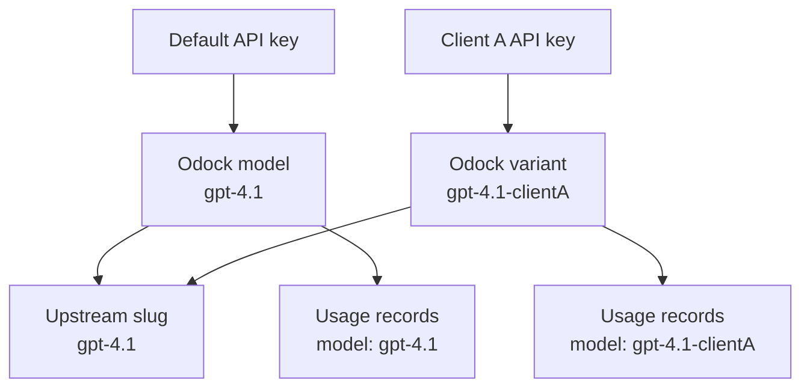

# Add a variant model

A variant model is a second Odock model record that points to the same upstream provider model slug but uses a different Odock model name.

For example, you can create `gpt-4.1-clientA` as the Odock model name while keeping `gpt-4.1` as the upstream slug. Applications for client A call `gpt-4.1-clientA`, and Odock forwards the request to the upstream `gpt-4.1` model.

## Why Use A Variant Model

Use a variant model when different teams, clients, projects, or environments need different governance around the same upstream model.

Common reasons include:

- **Client-specific naming**: expose `gpt-4.1-clientA` to a client project without changing the upstream provider slug.
- **Different pricing**: apply a client contract, internal markup, discount, or project-specific pricing to one model record while another record keeps default pricing.
- **Different policies**: set stricter rate limits, IP rules, or payload limits for one project.
- **Separate access grants**: give one API key access to `gpt-4.1-clientA` without granting access to the default `gpt-4.1` model record.
- **Cleaner usage reporting**: make usage records clearly show which client, project, or workload requested the model.
- **Migration safety**: point a stable project-specific model name to a new upstream slug later without changing application code.



## How It Works

The model **Name** is what applications send to Odock. The model **Slug** is what Odock sends to the upstream provider.

For a variant model:

| Field | Example |
| --- | --- |
| Name | `gpt-4.1-clientA` |
| Slug | `gpt-4.1` |
| Provider | Same provider as the original model |
| Provider Key | Same key or a different provider key, depending on your setup |
| Pricing | Default pricing or client/project-specific pricing |
| Policies | Default policies or variant-specific policies |

## Create A Variant From The Catalog

When the catalog detects that the same slug already exists, it lets you create another model with a different Odock name.

<Steps>

<Step>
Open the provider detail page for the provider that already has the base model.
</Step>

<Step>
In the **Models** section, click **Batch Create**.
</Step>

<Step>
Select the provider key.
</Step>

<Step>
Find the model with the existing upstream slug, such as `gpt-4.1`.
</Step>

<Step>
Click **Add with different name**.
</Step>

<Step>
Enter the new Odock model name, such as `gpt-4.1-clientA`.
</Step>

<Step>
Create the selected model.
</Step>

<Step>
Open the new model and adjust pricing, policies, and API key access for the client or project.
</Step>

</Steps>


## After Creating The Variant

After creating the variant, grant access only to the API keys that should use it. If the variant is for a specific client or project, update that application's model setting to the variant name, for example:

```json
{
  "model": "gpt-4.1-clientA"
}
```

Then review usage records to confirm traffic appears under the variant model name.

