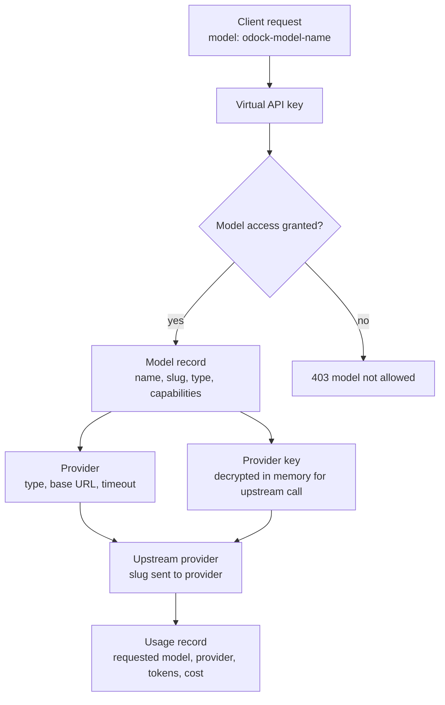
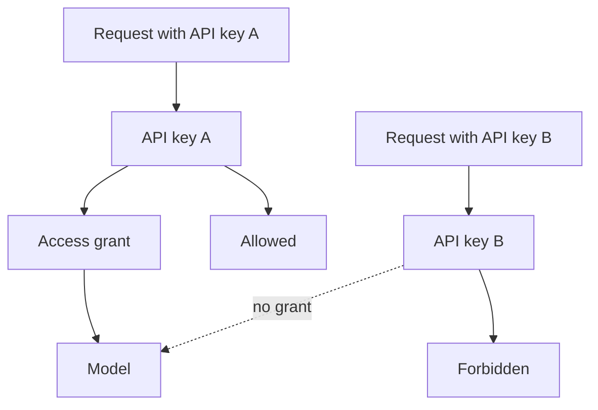

# Models

Models are organisation-scoped records that applications call through Odock.

When a client sends `model: "gpt-4.1-mini"` to Odock, it is using the Odock model name. The model record tells the gateway which upstream provider to use, which upstream model slug to send, which provider key to use, what pricing applies, and which policies are attached.

## Model Resolution

The model name is the stable name your application uses. The slug is the upstream provider model id. They are often the same, but they do not have to be.

| Field | Example | Meaning |
| --- | --- | --- |
| Name | `support-fast` | The model name clients send to Odock. |
| Slug | `gpt-4.1-mini` | The upstream model id sent to the provider. |
| Provider | `OpenAI` | The upstream provider connection. |
| Provider key | `Production` | The encrypted upstream credential Odock uses. |

This lets you move `support-fast` from one provider key or upstream slug to another without changing application code, as long as you preserve the Odock model name.

## Model Types And Capabilities

Model type is used for filtering, routing decisions, and user clarity.

Common model types include:

- `chat`
- `reasoning`
- `image`
- `embeddings`
- `audio`
- `moderation`
- `transcription`
- `tts`

Capabilities describe features the model supports, such as:

- `vision`
- `reasoning`
- `tool_use`

Capabilities appear in the model UI and help users choose the correct model. They can also guide routing and policy decisions as your organisation standardizes model usage.

## Model Pricing

Model pricing is used to calculate cost in usage records and to enforce budgets. Pricing is stored on the model so billing follows the model that was actually used.

For the pricing fields, usage calculation flow, and pricing type table, see [Model Pricing](/docs/models-and-mcp/models/model-pricing).

## Model Policies

Model policies let you set resource-specific limits. In the UI, the **Policies** card supports IP allow/block lists, token limits, payload limits, request rates, and concurrency limits.

These policies are runtime guardrails. A request must pass the API key access check and the applicable rate, payload, IP, budget, quota, SafetySec, and plugin gates.

For the broader policy model, see [Guardrails](/docs/security-and-guardrails/guardrails) and [SafetySec Engine](/docs/security-and-guardrails/safetysec-engine).

## Model Access Grants

A model existing in the organisation does not mean every key can call it. Runtime model access is granted through `Model Access` on the virtual API key or through `API Key Access` on the model detail page.

Use model access grants to answer: "Which virtual API keys can call this model?"

## Model Workflows

- [Add models from the catalog](/docs/models-and-mcp/models/add-models-from-catalog)
- [Add a model manually](/docs/models-and-mcp/models/add-model-manually)
- [Review a model detail page](/docs/models-and-mcp/models/review-model-detail)
- [Understand model pricing](/docs/models-and-mcp/models/model-pricing)
- [Edit model pricing](/docs/models-and-mcp/models/edit-model-pricing)
- [Edit model policies](/docs/models-and-mcp/models/edit-model-policies)
- [Grant a model to an API key](/docs/models-and-mcp/models/grant-model-to-api-key)
- [Grant API keys to a model](/docs/models-and-mcp/models/grant-api-keys-to-model)

## Usage Records

After traffic runs, usage records show request time, API key, organisation, team, user attribution, requested model, provider, HTTP status, latency, token breakdown, billing breakdown, raw provider usage, and routing metadata when routing was involved.

If a call does not appear in usage, confirm the request went through Odock rather than directly to the upstream provider.

## Troubleshooting

| Symptom | What to check |
| --- | --- |
| `model not found` | Confirm the client is using the Odock model name, not a deleted or misspelled name. |
| `403` or model not allowed | Confirm the virtual API key has a Model Access grant. |
| Provider mismatch | Confirm the endpoint family matches the model provider type. |
| No cost in usage | Confirm model pricing is configured for the model and token type. |
| Budget blocks the request | Review API key, team, user, and organisation budgets. |
| Quota blocks the request | Review matching quotas and the quota period. |

Continue with [MCP Servers](/docs/models-and-mcp/mcp-servers) if you also need governed tool access.
