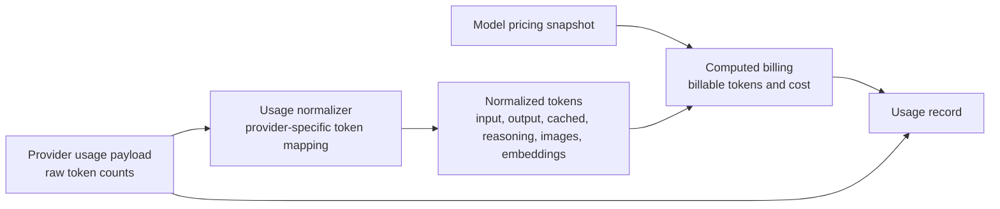

# Model Pricing

Model pricing is used to calculate cost in usage records and to enforce budgets. Pricing is stored on the model so billing follows the model that was actually used.

In the UI, model pricing is edited as human-readable USD per 1M tokens. Internally, the gateway normalizes usage from the upstream provider, then calculates cost using the model pricing snapshot.

Pricing can include input text cost, output text cost, image cost, audio cost, video cost, reasoning cost, cached input discounts, embeddings cost, fine-tuning cost, tool-related cost metadata, and notes.

## Pricing Types

| Pricing type | What it represents | Used when |
| --- | --- | --- |
| Input text | Cost for prompt, message, or text input tokens. | Chat, reasoning, completion, and text-processing requests. |
| Output text | Cost for generated text output tokens. | Chat, reasoning, completion, and text generation responses. |
| Input image | Cost for image input tokens or image input units. | Vision requests where the model receives images. |
| Output image | Cost for generated image output tokens or image output units. | Image generation, image edits, or image variation endpoints. |
| Input audio | Cost for audio input tokens or units. | Audio understanding, transcription, or multimodal requests with audio input. |
| Output audio | Cost for generated audio output tokens or units. | Text-to-speech or multimodal responses with audio output. |
| Input video | Cost for video input tokens or units. | Multimodal models that accept video input. |
| Output video | Cost for generated video output tokens or units. | Video generation or multimodal responses with video output. |
| Reasoning | Cost for reasoning or thinking tokens reported by the provider. | Reasoning models that expose a separate reasoning token count. |
| Cached input discount | Percentage discount applied to cached input tokens. | Providers that report cache hits or cached prompt tokens. |
| Embeddings | Cost for embedding tokens. | Embedding endpoints where usage is counted separately from text generation. |
| Units | Cost for a generic per-unit quantity (per 1,000 units), with a human-readable unit label. | Per-unit endpoints billed independently of tokens, such as OCR pages (see note below). |
| Fine-tuning training | Cost for tokens used while training or fine-tuning a model. | Fine-tuning workflows when training cost is tracked. |
| Fine-tuning usage | Cost for tokens used by a fine-tuned model. | Runtime calls to fine-tuned models with separate rates. |
| Tool pricing | Optional cost metadata for tool definitions, tool inputs, or tool outputs. | Model calls that include tools and where tool-related token costs need separate reporting. |
| Notes | Human-readable pricing notes. | Explaining provider-specific assumptions, contract pricing, or known limitations. |

## Per-Page Pricing (OCR)

Some endpoints are billed per unit rather than per token. Mistral OCR (`ocr` model type) is billed per page: the gateway reads `usage_info.pages_processed` from the provider response and prices it through the dedicated **units** rate, where one unit equals one page. The normalizer labels the unit (here, `pages`) so usage records stay self-describing.

To bill Mistral OCR at its list price of about `$1` per `1000` pages, set the model's units cost so one page costs `$0.001` (a units rate of `$1` per 1,000 units). Adding `mistral-ocr-latest` from the model catalog configures this automatically. In the resulting usage record, the page count appears as the billable quantity and the cost appears under the dedicated units cost field (`units_cost_usd` / `units_cost_nanos_usd`), separate from token and embeddings costs.

## Usage Calculation

Usage records keep normalized tokens, computed billing, and the raw provider usage payload for reconciliation.

For usage monitoring, see [Usage Monitoring](/docs/observability/usage-records). For budgets, see [Budgets](/docs/management/budgets). To change pricing in the UI, see [Edit model pricing](/docs/models-and-mcp/models/edit-model-pricing).
