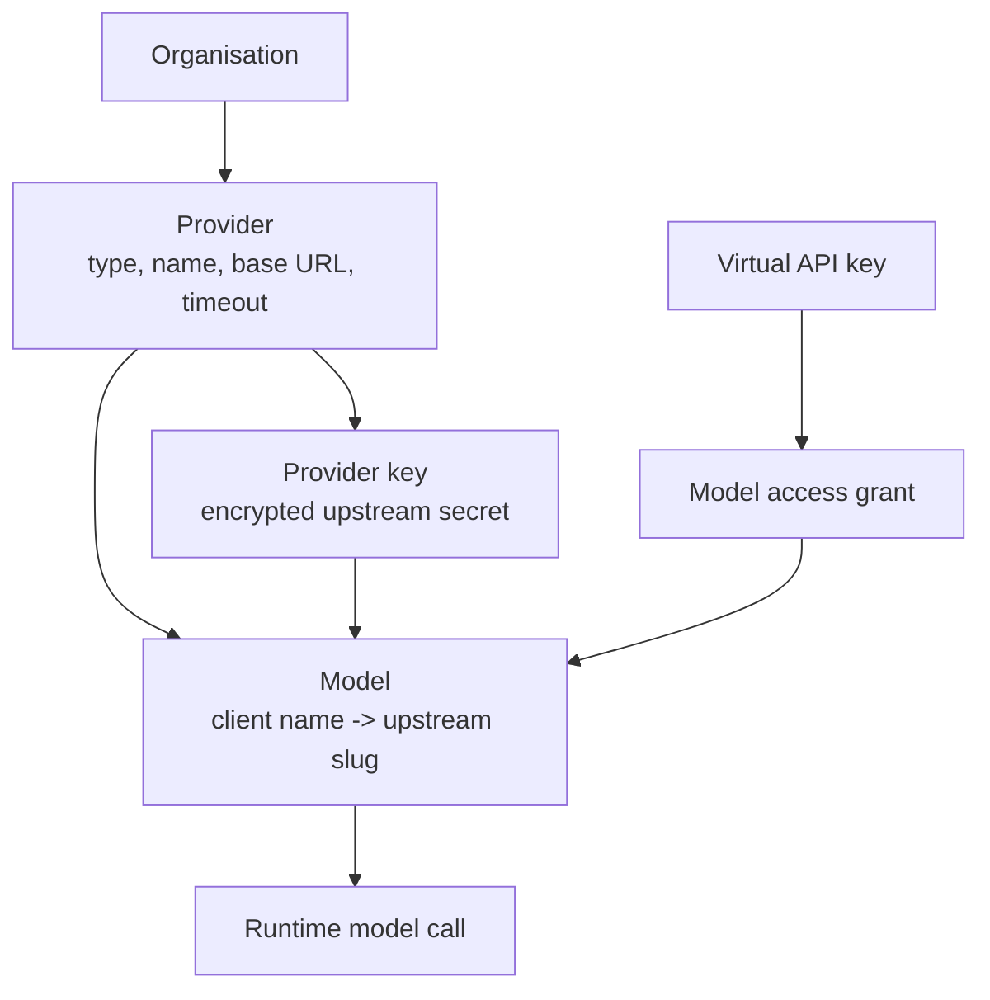

# Providers

Providers are the upstream AI services that Odock can call on your behalf. Examples include OpenAI, Anthropic, Google Gemini, Azure OpenAI, vLLM, Mistral, and custom-compatible providers.

A provider is not the same as a model. The provider defines where and how Odock connects. A model defines what your applications request and how that request maps to an upstream model slug.

## Provider Hierarchy

The provider and provider key are setup dependencies. The virtual API key is the credential your application uses. Your app never needs the upstream provider key.

## Provider Types

The organisation UI supports these provider types:

| Provider type | Typical use |
| --- | --- |
| `OPENAI` | OpenAI chat, responses, embeddings, image, and compatible OpenAI-style traffic. |
| `ANTHROPIC` | Claude models through Anthropic-compatible endpoints. |
| `GOOGLE` | Gemini models through Gemini-compatible endpoints. |
| `AZURE_OPENAI` | OpenAI models hosted on Azure OpenAI. |
| `VLLM` | Self-hosted vLLM inference endpoints. |
| `MISTRAL` | Mistral La Plateforme: chat, Codestral FIM, embeddings, moderation, and OCR. |
| `CUSTOM` | A custom or compatible upstream where your Odock deployment supports the route shape. |

The provider type matters because native endpoints are provider-family aware. For example, an OpenAI-compatible endpoint expects a model configured for an OpenAI-compatible provider family. If a request tries to use a model from the wrong family, the gateway can reject it with a provider mismatch error.

For endpoint behavior, see [Endpoints](/docs/models-and-mcp/endpoints) and [Native Models call](/docs/usage/native-models-call).

## Provider Key Security

Odock separates upstream provider secrets from application credentials.

- The provider key is encrypted before storage.
- The full provider key is not displayed again in the UI after saving.
- The gateway resolves and decrypts the provider key only when it needs to call the upstream provider.
- Plaintext provider keys should not be copied into application code.

For deeper security concepts, see [Guardrails](/docs/security-and-guardrails/guardrails). For the runtime encryption flow, see [Architecture](/docs/getting-started/architecture).

## Provider Workflows

- [Activate a provider](/docs/models-and-mcp/providers/activate-provider)
- [Edit provider details](/docs/models-and-mcp/providers/edit-provider-details)
- [Add a provider key](/docs/models-and-mcp/providers/add-provider-key)
- [Add models from a provider](/docs/models-and-mcp/providers/add-models-from-provider)
- [Update model pricing from the catalog](/docs/models-and-mcp/providers/update-model-pricing-from-catalog)

## Troubleshooting

| Symptom | What to check |
| --- | --- |
| Provider does not appear active | Open **Providers**, clear filters, and confirm the provider card shows Active. |
| Cannot create models | Confirm the provider is active and has at least one provider key. |
| Gateway returns provider mismatch | Confirm the requested model belongs to the provider family used by the endpoint. |
| Upstream authentication fails | Rotate or replace the provider key, then test again. |
| Model calls time out | Review provider timeout and the upstream provider health. |

Continue with [Models](/docs/models-and-mcp/models) to configure model records, pricing, policies, and access.
