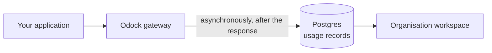

# Observability

Odock records what your applications do through the gateway and shows it back to you in two places:

- **Usage Records** — the audit trail of individual requests. One row per call, with status, latency, model, tokens, cost, and the routing trace.
- **Traffic Analytics** page — the analytics dashboard built on top of those records. Trends, percentiles, and tabs for traffic, latency, usage, MCP, plugins, and traces.
- **LGTM stack** — the full Grafana, Loki, Tempo, Prometheus, and Alertmanager workspace available when your company self-hosts Odock or runs the enterprise edition on its own infrastructure. See [LGTM Stack](/docs/observability/lgtm-stack).

## Pick The Right Surface

| You want to know... | Open |
| --- | --- |
| What did this specific request cost? Why did it fail? | [Usage Records](/docs/observability/usage-records). |
| How are requests trending for an API key, team, or model? | [Traffic Analytics page](/docs/observability/traffic-analytics). |
| Is one MCP tool or plugin slow? | [Traffic Analytics page](/docs/observability/traffic-analytics) → MCP or Plugins tab. |
| Did a routing fallback fire and why? | The Routing section on a [usage record](/docs/observability/usage-records/inspect-a-request). |
| Is the gateway itself healthy? | [LGTM Stack](/docs/observability/lgtm-stack) (platform operator). |

## How Data Reaches The UI

Recording happens after the response is returned to the client, so it never blocks your application. A new request can take a few seconds to appear in the table while the gateway finalises and writes it.

What is captured is request shape and accounting — status, latency, token counts, cost, routing attempts, plugin and safety outcomes. Prompts, completions, API keys, and provider credentials are never written into a usage record.

## Pages In This Section

- [Usage Records](/docs/observability/usage-records): per-request audit trail, analytics card, table, filters, and the record detail page.
- [Traffic Analytics page](/docs/observability/traffic-analytics): the organisation dashboard with traffic, latency, usage, MCP, plugins, and traces tabs.
- [LGTM Stack](/docs/observability/lgtm-stack): the platform-level monitoring stack used when self-hosting.
