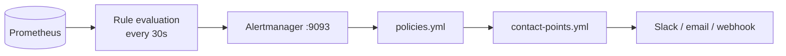

# Alerts

Alerts are the proactive side of the LGTM stack. They turn degraded telemetry or degraded request health into a notification flow before users need to discover the issue manually.

In most deployments, platform operators own alert routing and contact points. Organisation users who have stack access are still often expected to read the alert state, understand the alert family, and bring the right evidence to the platform team.

## Routing And Delivery

Alertmanager rules live under `observability/prometheus/rules/alerts.yml`. Delivery configuration is provisioned through Grafana alerting and Alertmanager configuration files.

## Alert Families

### Infrastructure

| Alert | Trigger | Severity |
| --- | --- | --- |
| `high_cpu_usage` | Host CPU above 85% for 10 minutes | warning |
| `high_memory_usage` | Host memory above 90% for 10 minutes | warning |
| `container_restart_loop` | More than 3 restarts in 15 minutes on a compose service | critical |
| `service_down` | Any core service down for 2 minutes | critical |

### OTel Pipeline

| Alert | Trigger | Severity |
| --- | --- | --- |
| `otlp_export_failures_sustained` | Collector exporter failing to send spans, metrics, or log records for 10 minutes | critical |

### Gateway Requests

| Alert | Trigger | Severity |
| --- | --- | --- |
| `gateway_request_5xx_spike` | 5xx ratio above 5% over 10 minutes with meaningful volume | critical |
| `provider_error_spike` | Per-provider error ratio above 10% over 10 minutes with meaningful volume | critical |
| `stream_failure_spike` | Streaming failure ratio above 10% over 10 minutes with meaningful volume | critical |

### Logger Pipeline

| Alert | Trigger | Severity |
| --- | --- | --- |
| `gateway_logs_dropped` | Any increase in dropped log records for 5 minutes | warning |
| `gateway_logs_write_errors` | Any increase in log write errors for 5 minutes | critical |

### Usage Collector

| Alert | Trigger | Severity |
| --- | --- | --- |
| `usage_collector_flush_failures` | Any increase in usage flush failures for 10 minutes | critical |
| `usage_collector_enqueue_failures` | Any increase in usage enqueue failures for 10 minutes | critical |

### Data Stores

| Alert | Trigger | Severity |
| --- | --- | --- |
| `postgres_readiness_degraded` | Postgres exporter or `pg_up` down for 5 minutes | critical |
| `redis_readiness_degraded` | Redis exporter or `redis_up` down for 5 minutes | critical |

### Service Health

| Alert | Trigger | Severity |
| --- | --- | --- |
| `service_metrics_missing` | A service previously seen in the last hour stops emitting runtime metrics for at least 10 minutes | critical |

### Token Volume Anomalies

| Alert | Trigger | Severity |
| --- | --- | --- |
| `gateway_token_throughput_spike` | 5-minute token rate above 3x the 1-hour baseline and above 500 tokens per second for 10 minutes | warning |
| `gateway_organization_token_concentration` | One organisation drives more than 60% of token throughput for 15 minutes | warning |
| `gateway_api_key_token_concentration` | One key drives more than 80% of its organisation's token throughput for 15 minutes | warning |
| `gateway_token_request_size_extreme` | P95 tokens per request above 50,000 for 10 minutes | warning |

## What To Do When An Alert Fires

| Alert family | First dashboard or action |
| --- | --- |
| Infrastructure | Open Infrastructure dashboards and locate the failing node or service |
| OTel pipeline | Open Traces folder, then **OTel Pipeline Health** |
| Request 5xx | Open **Gateway Request Dashboard** |
| Provider | Open **Provider Dashboard** for the affected provider |
| Stream failure | Open **Gateway Request Dashboard** and filter to streaming traffic |
| Logger | Open **Logger Health Dashboard** |
| Usage collector | Open **Usage / Budget Dashboard**, then cross-check Redis and Postgres health |
| Token concentration | Open **Token Usage Dashboard** and drill into the offending organisation or key |

If you are an organisation user without alert-routing permissions, stop at evidence collection and hand the result to the deployment owner.

## Tips

<Callout type="tip">
Token concentration alerts are an early signal of runaway workloads. Pair them with [budgets](/docs/management/budgets) and [quotas](/docs/management/quotas) where possible.
</Callout>

<Callout type="warning">
Critical alerts need configured contact points. Without delivery configuration, Alertmanager can accept alerts but no one will be notified.
</Callout>
