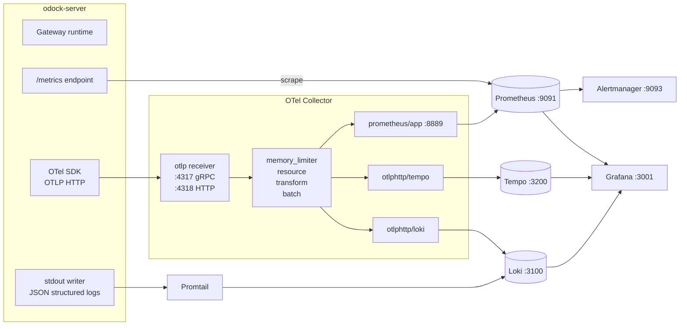

# Data flow

The LGTM stack is three observability pipelines sharing one investigation surface. Metrics, traces, and logs do not move through the system in the same way, but they meet again in Grafana when you need evidence for an incident.

Organisation users usually care about this page for one reason: it explains where to look when one signal is missing. Platform operators care because it describes the default wiring that must stay healthy.

## Three Signals, Three Pipelines

## Per-Signal Default Paths

| Signal | Default path | Backup or alternative |
| --- | --- | --- |
| Metrics | `odock-server` exposes Prometheus on `/metrics`. Prometheus scrapes `server:8080/metrics` every 15 seconds. | OTLP metrics export is available by setting `OBSERVABILITY_OTEL_METRICS_EXPORTER=otlphttp`, but one of the two paths must be disabled to avoid duplicate series. |
| Traces | `odock-server` exports OTLP traces over HTTP to the Collector, which batches and forwards them to Tempo. | None in the default stack. Tempo is the trace backend. |
| Logs | `odock-server` writes structured JSON to stdout. Promtail tails container logs and ships them to Loki. | OTLP logs export is available if you intentionally route logs through the Collector. |

The default pattern is deliberate:

- metrics via `/metrics`
- traces via OTLP
- logs via stdout plus Promtail

That keeps each signal on a simple, stable path and avoids duplicate telemetry for the gateway.

## Other Telemetry Sources

Prometheus also scrapes infrastructure exporters that are useful during platform incidents:

| Job | Target | Why it matters |
| --- | --- | --- |
| `prometheus` | self | Prometheus health |
| `loki` | `loki:3100/metrics` | Loki ingest and query health |
| `tempo` | `tempo:3200/metrics` | Tempo ingest health |
| `otel-collector` | `:8888/metrics` | Collector self-metrics |
| `otel-collector-app-metrics` | `:8889/metrics` | OTLP-imported application metrics |
| `node-exporter` | host metrics | CPU, memory, disk |
| `cadvisor` | container metrics | Per-container CPU and memory |
| `traefik` | `:8082/metrics` | Edge proxy health |
| `postgres-exporter` | `:9187` | Postgres readiness |
| `redis-exporter` | `:9121` | Redis readiness |

These exporters feed the infrastructure dashboards described in [Grafana dashboards](/docs/observability/lgtm-stack/grafana-dashboards).

## Resource Attributes

All three signals carry a shared resource identity so you can join them during an investigation:

- `service.name`, `service.namespace`, `service.version`, `service.instance.id`
- `deployment.environment.name`
- `k8s.cluster.name`, `k8s.namespace.name`, `k8s.deployment.name`, `k8s.pod.name`, `k8s.node.name`

Those values come from `OBSERVABILITY_*` environment variables on `odock-server` and from Collector-side enrichment. See [OTEL configuration](/docs/observability/lgtm-stack/otel-config).

## Tips

<Callout type="tip">
When a dashboard panel is empty, check the path in this order: gateway emits, exporter or Collector accepts, backend stores, Grafana queries.
</Callout>

<Callout type="warning">
Do not enable both Prometheus scraping and OTLP metrics export for `odock-server` at the same time. Queries will silently double-count.
</Callout>
