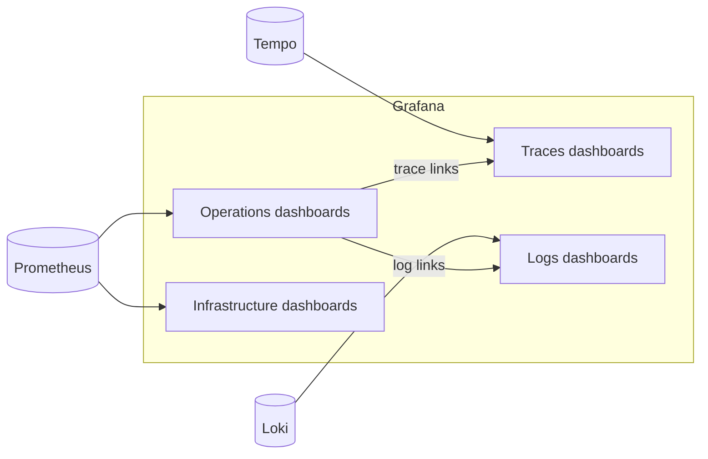

# Grafana dashboards

Grafana is the main investigation surface of the LGTM stack. It is provisioned automatically when the `observability` profile is enabled.

Depending on your role, you may see the full workspace or only a subset of folders. Organisation users often get read-only access to the dashboards relevant to their deployment. Platform operators usually see all folders, data sources, and alerting controls.

Default URL: `http://127.0.0.1:3001`

Default user: `admin`

Password source: `GRAFANA_ADMIN_PASSWORD`

## Folders

| Folder | Audience | What it contains |
| --- | --- | --- |
| **Infrastructure** | Platform operators | Host CPU, memory, disk, and node-level health from `node-exporter` |
| **Containers** | Platform operators | Per-container health from cAdvisor |
| **Applications** | Platform operators | Shared application-level views across services |
| **Operations** | Organisation users with stack access, SRE | Gateway-specific dashboards for requests, providers, safety, plugins, budgets, cache, and logger health |
| **Organizations** | Platform operators, some enterprise users | Tenant comparison across organisations on the same deployment |
| **Logs** | Investigation users, platform operators | Loki-backed log dashboards and Explore entry points |
| **Traces** | Investigation users, platform operators | Tempo overview and OTel pipeline health |

## Operations Folder

The Operations folder is the first place most Odock investigations begin.

| Dashboard | Purpose |
| --- | --- |
| **Gateway Request Dashboard** | Request volume, status mix, p50/p95/p99 latency, and streaming sessions |
| **Provider Dashboard** | Per-provider request rate, error rate, and latency |
| **Rate Limit Dashboard** | Rate-limit decisions, rejections, and stage-level behavior |
| **Backend Safety Dashboard** | SafetySec module runs, blocks, redactions, and decisions |
| **Token Usage Dashboard** | Token throughput by provider, model, organisation, and key |
| **Usage / Budget Dashboard** | Budget reservation, settlement, and decision counters |
| **Cache Revalidation Dashboard** | Cache invalidate traffic and Redis publish or consume behavior |
| **Logger Health Dashboard** | Log enqueue, drop, write error, batch size, queue depth, and flush duration |

## Traces Folder

| Dashboard | Purpose |
| --- | --- |
| **Traces Overview** | Cross-service trace shape, error spans, and slow endpoints |
| **OTel Pipeline Health** | Collector exporter success and failure rates plus queue health |

## Organizations Folder

| Dashboard | Purpose |
| --- | --- |
| **Organizations Overview** | Per-organisation traffic, token, and cost comparison |

Some deployments may hide this folder from organisation users when it exposes tenant-wide comparisons they should not see.

## How Dashboards Connect To The Rest

The key workflow is symptom to evidence:

1. spot an anomaly in a metrics dashboard
2. jump to a trace or a filtered log view
3. correlate the result with the matching [usage record](/docs/observability/usage-records/record-details)

## Tips

<Callout type="tip">
Open the Gateway Request Dashboard and the Provider Dashboard first when a user reports a production issue. Together they usually tell you whether the problem is gateway-side, provider-side, or isolated to one workload.
</Callout>

<Callout type="warning">
Dashboard JSON files are provisioned from `observability/grafana/dashboards/`. UI edits should be exported back to the file set or they will be lost on restart.
</Callout>
