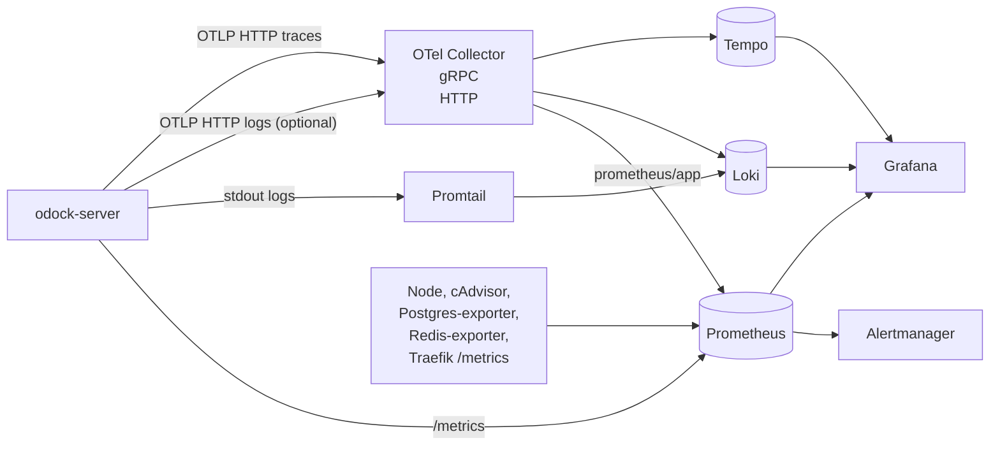

# LGTM Stack

The LGTM stack is the platform observability workspace for Odock deployments that run on your company's infrastructure. It is available when:

- you self-hosts Odock
- your company runs the enterprise edition on its own server or private infrastructure

This section is written for two audiences:

- organisation users who have been given read-only or investigation access to Grafana, Loki, Tempo, and Prometheus
- platform operators who manage the deployment and own retention, alerting, and OTEL wiring

If you do not have access to the stack, use [Usage Records](/docs/observability/usage-records) and [Traffic Analytics](/docs/observability/traffic-analytics) instead.

## What The Stack Adds

The LGTM stack complements the in-product observability surfaces:

- **Prometheus** metrics for the gateway and surrounding infrastructure
- **Tempo** traces for the request lifecycle
- **Loki** logs for structured gateway logging
- **Grafana** dashboards and drill-down workflows over all three
- **Alertmanager** rules for operational notifications

The stack is provisioned by the `observability` profile in the root [Docker Compose](/docs/self-host/docker-compose). Configuration lives under `observability/` in the repository root.

## Pick The Right Surface

| Question | Best place to start |
| --- | --- |
| What happened to one specific request? | [Usage Records](/docs/observability/usage-records) |
| How are traffic, latency, tokens, or cost trending for my organisation? | [Traffic Analytics](/docs/observability/traffic-analytics) |
| Is the gateway, provider path, log pipeline, or trace pipeline healthy? | LGTM stack |
| Do I need metrics, traces, and logs in one investigation workflow? | LGTM stack |

Usage records are the product-facing audit trail. The LGTM stack is the operational evidence layer around the gateway itself.

## Why A Separate Stack

| Surface | Source of truth | Primary audience |
| --- | --- | --- |
| Usage Records / Traffic Analytics | Database | Organisation users |
| LGTM stack | Gateway metrics, traces, logs, and infrastructure exporters | Organisation users with stack access, platform operators |

The distinction matters because a failed or degraded request can have two very different causes:

- the request itself was rejected, rerouted, blocked, or priced in a specific way
- the platform around the request was unhealthy, slow, or partially failing before or after the usage record was written

The first answer comes from the Odock UI. The second answer comes from LGTM.

## High-Level Components



For the per-signal view, see [Data flow](/docs/observability/lgtm-stack/data-flow).

## Default Ports

| Service | URL |
| --- | --- |
| Grafana | `http://127.0.0.1:3001` |
| Prometheus | `http://127.0.0.1:9091` |
| Alertmanager | `http://127.0.0.1:9093` |
| Loki | `http://127.0.0.1:3100` |
| Tempo | `http://127.0.0.1:3200` |
| OTLP HTTP | `127.0.0.1:4318` |
| OTLP gRPC | `127.0.0.1:4317` |


## Start The Stack

If you operate the deployment yourself:

```bash
docker compose --profile observability up -d
```

Run from the repository root. To pin env values, copy `observability/.env.example` to `observability/.env` and either merge it into the repo `.env` or pass `--env-file observability/.env`.

For the end-to-end deployment path, see [Self-host Observability Stack](/docs/self-host/observability-stack).

## What `odock-server` Emits

By default the gateway:

- exposes Prometheus metrics on `/metrics`
- exports OTLP traces to the OTel Collector at `http://otel-collector:4318`
- writes structured logs to stdout so Promtail can forward them to Loki

The Collector also accepts OTLP metrics and logs from other services in the platform and forwards them to Prometheus, Tempo, and Loki. `odock-server` keeps the simpler `/metrics` scrape path by default to avoid duplicate time series.

```dotenv
OBSERVABILITY_OTEL_EXPORTER=otlphttp
OBSERVABILITY_OTEL_TRACES_EXPORTER=otlphttp
OBSERVABILITY_OTEL_METRICS_EXPORTER=none
OBSERVABILITY_OTEL_ENDPOINT=http://otel-collector:4318
OBSERVABILITY_SERVICE_NAME=odock-server
OBSERVABILITY_SERVICE_NAMESPACE=odock
OBSERVABILITY_SERVICE_VERSION=dev
OBSERVABILITY_SERVICE_INSTANCE_ID=${HOSTNAME}
OBSERVABILITY_DEPLOYMENT_ENVIRONMENT=production
OBSERVABILITY_SAMPLE_RATE=0.1
```

See [OTEL configuration](/docs/observability/lgtm-stack/otel-config) for the full variable set and Kubernetes wiring.

## Concept Pages

- [Data flow](/docs/observability/lgtm-stack/data-flow): how metrics, traces, and logs move from the gateway to Grafana
- [Metrics](/docs/observability/lgtm-stack/metrics): the gateway metric catalog and label policy
- [Traces](/docs/observability/lgtm-stack/traces): span hierarchy, key dimensions, and request correlation
- [Logs](/docs/observability/lgtm-stack/logs): structured logging, safe logging rules, and correlation fields
- [Grafana dashboards](/docs/observability/lgtm-stack/grafana-dashboards): what each provisioned folder and dashboard is for
- [Alerts](/docs/observability/lgtm-stack/alerts): the alert families shipped with the stack
- [OTEL configuration](/docs/observability/lgtm-stack/otel-config): environment variables and Kubernetes wiring for platform owners

## Tutorials

- [Open Grafana and choose the right surface](/docs/observability/lgtm-stack/tutorials/access-and-navigation)
- [Investigate one request across usage, traces, and logs](/docs/observability/lgtm-stack/tutorials/investigate-request)
- [Investigate provider latency or errors](/docs/observability/lgtm-stack/tutorials/investigate-provider-health)
- [Review alerts and pipeline health](/docs/observability/lgtm-stack/tutorials/review-alerts)
