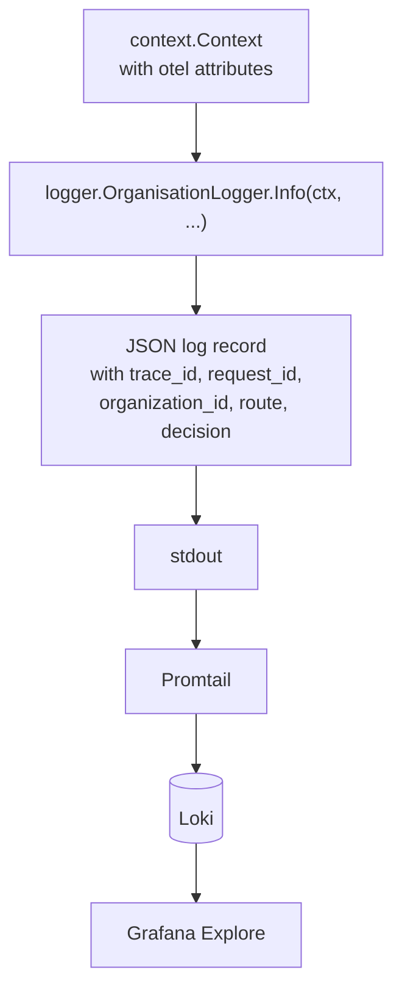

# Logs

Logs are the textual evidence layer of the LGTM stack. They are most useful when you already know the request id, trace id, provider, plugin, or time window you need to investigate.

`odock-server` writes structured JSON logs to stdout. Promtail tails container stdout and forwards the records to Loki.

## Why Stdout Plus Promtail Is The Default

The default production strategy is:

- traces and metrics via OpenTelemetry
- logs via `logger.OrganisationLogger`
- correlation via shared context fields and `trace_id` / `span_id`
- structured JSON as the canonical log format

This keeps the gateway on one logging path and avoids a second production log pipeline for the same records.

## Correlation Fields

During a traced request, log records can include:

| Field | Meaning |
| --- | --- |
| `trace_id`, `span_id` | OpenTelemetry trace correlation |
| `request_id` | Gateway request id, same as `X-Request-Id` |
| `organization_id` | Owning organisation |
| `provider`, `model`, `route`, `endpoint` | Routed target attributes |
| `module` | Active subsystem |
| `plugin_chain`, `plugin_name`, `plugin_stage` | Plugin pipeline coordinates |
| `security_module` | Active safety module |
| `ratelimit_stage`, `ratelimit_module` | Rate-limit position |
| `decision` | Stable per-phase decision label |

## What Is Never Logged

The gateway observability layer does not emit:

- prompt or completion bodies
- API keys, auth headers, or raw provider credentials
- decoded request payloads

That keeps LGTM suitable for operational investigation without turning it into a content store.

## Logger Pipeline Health

The log pipeline exports its own health metrics:

| Metric | Purpose |
| --- | --- |
| `gateway.logs.enqueued.total` | Records accepted into the in-process queue |
| `gateway.logs.dropped.total` | Records dropped because the queue was full |
| `gateway.logs.write_errors.total` | Backend write errors |
| `gateway.logs.batch_size` | Histogram of batch sizes |
| `gateway.logs.queue_depth` | Current queue depth |
| `gateway.logs.flush_duration` | Histogram of flush durations |

These metrics back the Logger Health dashboard and the log pipeline alerts. See [Grafana dashboards](/docs/observability/lgtm-stack/grafana-dashboards) and [Alerts](/docs/observability/lgtm-stack/alerts).

## Optional File And S3 Archives

If your deployment needs archive paths outside Loki:

- set `LOGGER_OUTPUT=stdout,file`
- make `ODOCK_SERVER_LOGS_PATH` writable by the container user
- extend the examples under `docs/observability` for file rotation or S3-compatible archives

These paths supplement stdout shipping. They do not replace it.

## Tips

<Callout type="tip">
Filter Loki by structured fields such as `request_id`, `provider`, or `plugin_name` instead of broad free-text search.
</Callout>

<Callout type="warning">
If you fork the gateway and enable OTEL logs for `odock-server`, disable the stdout plus Promtail path for that service or you will duplicate log records.
</Callout>
