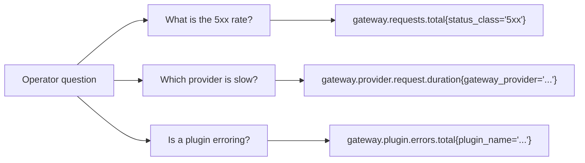

# Metrics

Metrics are the aggregated health signal of the LGTM stack. They answer questions like:

- is the gateway healthy
- is one provider slow or erroring
- are plugins adding overhead
- is the usage or budget pipeline failing

The stack keeps gateway metrics intentionally low-cardinality so dashboards, recording rules, and alerts remain cheap and predictable.

## Catalog

### Requests

| Metric | Type | Notes |
| --- | --- | --- |
| `gateway.requests.total` | counter | One increment per request, labeled by status class. |
| `gateway.request.duration` | histogram | Total request latency. |
| `gateway.requests.in_flight` | up-down counter | Concurrent in-flight requests. |

### Providers

| Metric | Type |
| --- | --- |
| `gateway.provider.requests.total` | counter |
| `gateway.provider.request.duration` | histogram |
| `gateway.provider.errors.total` | counter |

### Plugins

| Metric | Type |
| --- | --- |
| `gateway.plugin.executions.total` | counter |
| `gateway.plugin.execution.duration` | histogram |
| `gateway.plugin.errors.total` | counter |

### Routing

| Metric | Type |
| --- | --- |
| `gateway.routing.decisions.total` | counter |
| `gateway.routing.duration` | histogram |
| `gateway.routing.attempts` | histogram |
| `gateway.routing.errors.total` | counter |

### Rate Limit, Security, Cache

| Metric | Type |
| --- | --- |
| `gateway.ratelimit.decisions.total` | counter |
| `gateway.ratelimit.rejections.total` | counter |
| `gateway.security.module_runs.total` | counter |
| `gateway.security.blocks.total` | counter |
| `gateway.security.redactions.total` | counter |
| `gateway.security.decisions.total` | counter |
| `gateway.cache.lookups.total` | counter |

### Streaming

| Metric | Type |
| --- | --- |
| `gateway.stream.sessions.total` | counter |
| `gateway.stream.duration` | histogram |

### Usage And Budgets

| Metric | Type |
| --- | --- |
| `gateway.usage.publish.total` | counter |
| `gateway.usage.enqueue_errors.total` | counter |
| `gateway.usage.ingest_errors.total` | counter |
| `gateway.usage.flush_errors.total` | counter |
| `gateway.usage.flushed.total` | counter |
| `gateway.usage.queue_depth` | gauge |
| `gateway.budget.decisions.total` | counter |

### Tokens

`gateway.tokens.total` counters exist per class, including input, output, cached, reasoning, embeddings, tool-input, tool-output, billable, and rejected tokens.

These series feed token-throughput, spend, and concentration dashboards.

### Async Pools

| Metric | Type |
| --- | --- |
| `gateway.async.queue_depth` | gauge |
| `gateway.async.tasks.total` | counter |
| `gateway.async.task.duration` | histogram |

### Logger Pipeline

| Metric | Type |
| --- | --- |
| `gateway.logs.enqueued.total` | counter |
| `gateway.logs.dropped.total` | counter |
| `gateway.logs.write_errors.total` | counter |
| `gateway.logs.batch_size` | histogram |
| `gateway.logs.queue_depth` | gauge |
| `gateway.logs.flush_duration` | histogram |

### Process Runtime

| Metric | Type |
| --- | --- |
| `process.runtime.go.goroutines` | gauge |
| `process.runtime.go.mem.heap_alloc` | gauge |
| `process.runtime.go.mem.heap_inuse` | gauge |
| `process.runtime.go.mem.heap_objects` | gauge |
| `process.runtime.go.gc.cycles` | counter |
| `process.runtime.go.gc.pause_total` | counter |
| `process.runtime.uptime` | gauge |

## How Organisation Users Usually Consume Metrics

Most organisation users will not query Prometheus directly. They will see these metrics through Grafana dashboards such as:

- **Gateway Request Dashboard**
- **Provider Dashboard**
- **Rate Limit Dashboard**
- **Token Usage Dashboard**
- **Logger Health Dashboard**

See [Grafana dashboards](/docs/observability/lgtm-stack/grafana-dashboards).

## Label Policy

Allowed labels are bounded values such as:

- `provider`
- `route`
- `endpoint`
- `plugin_name` and `plugin_stage`
- `ratelimit_stage` and `ratelimit_module`
- `security_module`
- `decision`
- `status_class`
- `stream`
- `cache_hit`
- `async_pool_name`

High-cardinality fields like `request_id`, `trace_id`, and `organization_id` stay on traces and logs instead of metrics.

## Tips

<Callout type="tip">
Use recorded series and prebuilt dashboards for first-line investigation. Raw histogram queries are usually unnecessary outside deep debugging.
</Callout>

<Callout type="warning">
Changing labels on an existing metric is a breaking change for dashboards and alerts. If you extend the gateway, prefer adding a new metric instead of mutating an existing one.
</Callout>
