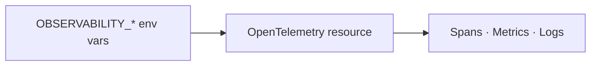

# OTEL configuration

This page is primarily for platform owners and operators. Organisation users who only investigate requests usually do not need to change OTEL settings, but understanding the variables helps explain why signals are labeled and sampled the way they are.

`odock-server` configures OpenTelemetry from `OBSERVABILITY_*` environment variables. The same set controls exporter selection, endpoint wiring, resource attributes, and trace sampling.

## Environment Variables

| Variable | Default in compose | Meaning |
| --- | --- | --- |
| `OBSERVABILITY_OTEL_EXPORTER` | `otlphttp` | Default exporter for any signal without an explicit override |
| `OBSERVABILITY_OTEL_TRACES_EXPORTER` | `otlphttp` | Trace exporter. Set `none` to disable trace export |
| `OBSERVABILITY_OTEL_METRICS_EXPORTER` | `none` | Metrics exporter. `/metrics` scraping is the default path |
| `OBSERVABILITY_OTEL_ENDPOINT` | `http://otel-collector:4318` | OTLP HTTP endpoint of the Collector |
| `OBSERVABILITY_SERVICE_NAME` | `odock-server` | Stable service identifier across replicas |
| `OBSERVABILITY_SERVICE_NAMESPACE` | `odock` | Logical service namespace |
| `OBSERVABILITY_SERVICE_VERSION` | `dev` | Build version |
| `OBSERVABILITY_SERVICE_INSTANCE_ID` | `${HOSTNAME}` | Unique instance id |
| `OBSERVABILITY_DEPLOYMENT_ENVIRONMENT` | `production` | Environment label attached to all signals |
| `OBSERVABILITY_K8S_CLUSTER_NAME` | unset | Kubernetes cluster label |
| `OBSERVABILITY_K8S_NAMESPACE_NAME` | unset | Kubernetes namespace label |
| `OBSERVABILITY_K8S_DEPLOYMENT_NAME` | unset | Kubernetes deployment label |
| `OBSERVABILITY_K8S_POD_NAME` | unset | Pod label |
| `OBSERVABILITY_K8S_NODE_NAME` | unset | Worker node label |
| `OBSERVABILITY_SAMPLE_RATE` | `0.1` | Head sampling rate for traces |

If `OBSERVABILITY_SERVICE_INSTANCE_ID` is unset, the gateway falls back to `POD_NAME`, then `HOSTNAME`.

## How They Map To Resource Attributes



| Env var | Resource attribute |
| --- | --- |
| `OBSERVABILITY_SERVICE_NAME` | `service.name` |
| `OBSERVABILITY_SERVICE_NAMESPACE` | `service.namespace` |
| `OBSERVABILITY_SERVICE_VERSION` | `service.version` |
| `OBSERVABILITY_SERVICE_INSTANCE_ID` | `service.instance.id` |
| `OBSERVABILITY_DEPLOYMENT_ENVIRONMENT` | `deployment.environment.name` |
| `OBSERVABILITY_K8S_*` | `k8s.cluster.name`, `k8s.namespace.name`, `k8s.deployment.name`, `k8s.pod.name`, `k8s.node.name` |

## Kubernetes Wiring

For multi-replica deployments:

- keep `service.name` the same across replicas
- set `service.instance.id` to the pod name
- attach Kubernetes metadata so traces, metrics, and logs can be split by namespace, deployment, pod, or node

Recommended Deployment env block:

```yaml
env:
  - name: OBSERVABILITY_SERVICE_INSTANCE_ID
    valueFrom:
      fieldRef:
        fieldPath: metadata.name
  - name: OBSERVABILITY_K8S_POD_NAME
    valueFrom:
      fieldRef:
        fieldPath: metadata.name
  - name: OBSERVABILITY_K8S_NAMESPACE_NAME
    valueFrom:
      fieldRef:
        fieldPath: metadata.namespace
  - name: OBSERVABILITY_K8S_NODE_NAME
    valueFrom:
      fieldRef:
        fieldPath: spec.nodeName
  - name: OBSERVABILITY_K8S_DEPLOYMENT_NAME
    value: odock-gateway
  - name: OBSERVABILITY_K8S_CLUSTER_NAME
    value: prod-eu-1
```

If you run Grafana Alloy or the OpenTelemetry Collector in-cluster, enrich telemetry with the `k8sattributes` processor as well.

## OTLP Endpoint Choices

| Endpoint | When to use |
| --- | --- |
| `http://otel-collector:4318` | Default compose setup with OTLP HTTP |
| `http://otel-collector:4317` | gRPC alternative if your SDK configuration matches |
| External managed Collector | Hosted or centralised OTEL destination |

## Disabling Telemetry

To disable exported telemetry:

```dotenv
OBSERVABILITY_OTEL_TRACES_EXPORTER=none
OBSERVABILITY_OTEL_METRICS_EXPORTER=none
```

`/metrics` remains available from the runtime even if nothing scrapes it.

## Tips

<Callout type="tip">
Temporarily set `OBSERVABILITY_SAMPLE_RATE=1.0` during incident response if you need deterministic trace capture.
</Callout>

<Callout type="warning">
Do not enable both `/metrics` scraping and OTLP metrics export for `odock-server` at the same time unless you intentionally want duplicate series and have separated the queries.
</Callout>
