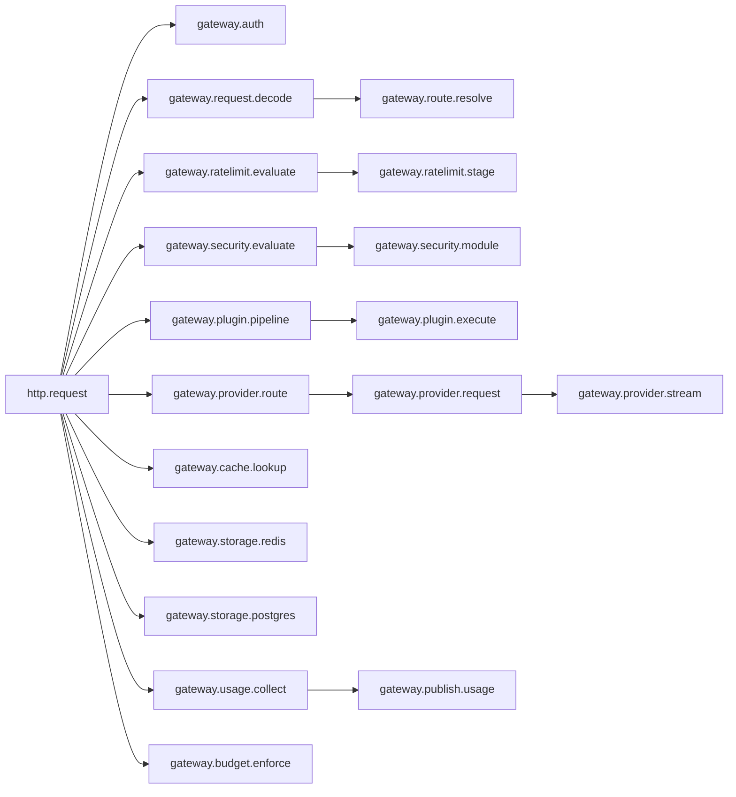
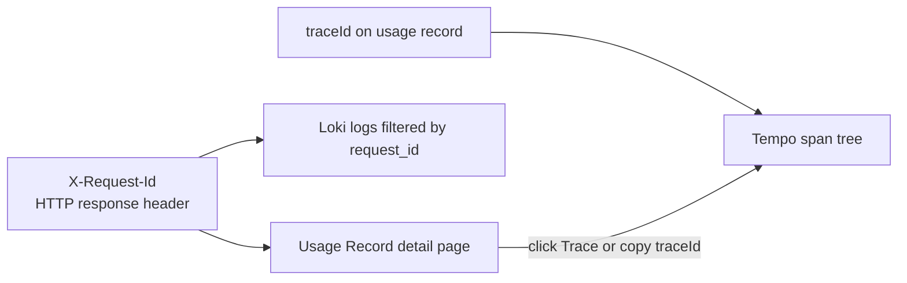

# Traces

Traces are the request reconstruction surface of the LGTM stack. When you need to understand where a request spent time or where it failed inside the gateway, traces are the most precise signal.

`odock-server` exports OpenTelemetry traces over OTLP HTTP to the OTel Collector, which forwards them to Tempo.

## Span Hierarchy

Important events within spans include:

- first stream chunk on `gateway.provider.stream`
- provider or routing retry events on `gateway.provider.request` and `gateway.route.resolve`
- `allow` or `reject` decisions on `gateway.ratelimit.stage`
- `allow` or `block` decisions on `gateway.security.module`
- `reserved`, `settled`, and `released` events on `gateway.budget.enforce`

## Canonical Trace Dimensions

Spans carry stable gateway attributes so you can filter by workload, route, plugin, or decision:

| Attribute | Meaning |
| --- | --- |
| `organization.id` | Owning organisation |
| `gateway.request_id` | Request id, also the `X-Request-Id` header |
| `gateway.provider` | Resolved provider id |
| `gateway.module` | Active subsystem such as auth, routing, plugin, or provider |
| `gateway.plugin.chain`, `gateway.plugin.name`, `gateway.plugin.kind`, `gateway.plugin.stage` | Plugin pipeline coordinates |
| `gateway.security.module` | Active safety module |
| `gateway.ratelimit.stage`, `gateway.ratelimit.module` | Rate-limit stage and module |
| `gateway.route`, `gateway.model`, `gateway.endpoint` | The resolved route, model, and endpoint |
| `gateway.stream` | Whether the request is streaming |
| `gateway.cache.hit` | Cache outcome |
| `gateway.decision` | Stable per-phase decision such as allow, block, or reroute |
| `gateway.retry_count` | Number of retries inside the span |
| `gateway.budget.window` | Budget window id when applicable |
| `gateway.usage.publisher` | Usage publisher target |
| `error.class` | Stable error classification |

## Correlation With Logs And Usage Records

The cross-surface chain is:

1. the application receives `X-Request-Id`
2. the same `requestId` appears on the [usage record detail page](/docs/observability/usage-records/record-details)
3. the same request id appears on gateway log lines in Loki
4. the `traceId` on the usage record opens the span tree in Tempo

That chain is what makes an investigation reproducible between application teams and platform teams.

## Sampling

Trace sampling is controlled by `OBSERVABILITY_SAMPLE_RATE`. The default production-style value is `0.1`, which keeps 10% of traces.

Usage Records and Traffic Analytics remain complete even when traces are sampled. If you cannot find a trace for a request, continue with usage records and logs.

See [OTEL configuration](/docs/observability/lgtm-stack/otel-config).

## Tips

<Callout type="tip">
When investigating provider incidents, group `gateway.provider.request` spans by `gateway.provider` first. That usually identifies the failing edge faster than a full trace-by-trace review.
</Callout>

<Callout type="warning">
A trace can leave `odock-server` successfully and still fail later in the Collector pipeline. If traces look incomplete, check Collector exporter failures in Prometheus.
</Callout>
