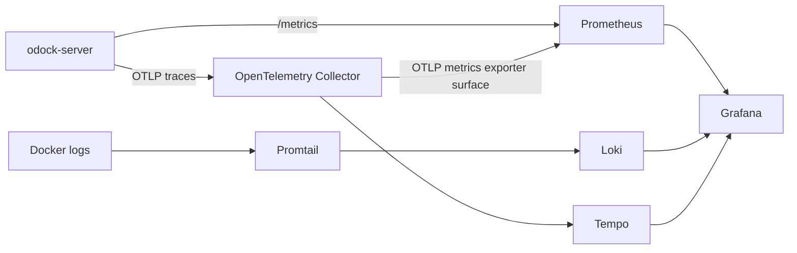

# Operating Observability

The observability profile is defined in root `docker-compose.yml` and configuration files under `observability/`.

## Start

```bash
docker compose --profile observability up -d
```

With an explicit env file:

```bash
docker compose --env-file observability/.env --profile observability up -d
```

## Components

| Component | Purpose |
| --- | --- |
| Prometheus | Metrics store and alert rule evaluation |
| Alertmanager | Alert notification routing |
| Loki | Log storage and search |
| Tempo | Trace storage and search |
| Grafana | Dashboards and Explore |
| OpenTelemetry Collector | OTLP ingest and export |
| Promtail | Container and host log collection |
| Node Exporter | Host metrics |
| cAdvisor | Container metrics |
| Redis exporter | Redis metrics |
| Postgres exporter | Postgres metrics |

## Signal Flow



Default server metrics path is `/metrics`. The collector also exposes `otel-collector:8889` for OTLP metrics from services that use OTLP metrics.

## Ports

| Service | Port |
| --- | --- |
| Grafana | `127.0.0.1:3001` |
| Prometheus | `127.0.0.1:9091` |
| Alertmanager | `127.0.0.1:9093` |
| Loki | `127.0.0.1:3100` |
| Tempo | `127.0.0.1:3200` |
| OTLP HTTP | `127.0.0.1:4318` |
| OTLP gRPC | `127.0.0.1:4317` |
| Collector health | `127.0.0.1:13133` |

## Retention Defaults

| Signal | Store | Default |
| --- | --- | --- |
| Metrics | Prometheus TSDB | `15d`, `10GB` |
| Logs | Loki filesystem | `336h` |
| Traces | Tempo local blocks | `168h` |

Override with:

```dotenv
PROMETHEUS_RETENTION_TIME=30d
PROMETHEUS_RETENTION_SIZE=30GB
LOKI_RETENTION_PERIOD=720h
TEMPO_RETENTION=168h
```

## Gateway Telemetry Settings

In Compose, the gateway is wired for Prometheus and traces by environment. Confirm these are set consistently:

```dotenv
OBSERVABILITY_PROMETHEUS_ENABLED=true
OBSERVABILITY_OTEL_TRACES_EXPORTER=otlphttp
OBSERVABILITY_OTEL_METRICS_EXPORTER=none
OBSERVABILITY_OTEL_ENDPOINT=http://otel-collector:4318
OBSERVABILITY_SERVICE_NAME=odock-server
OBSERVABILITY_SERVICE_NAMESPACE=odock
OBSERVABILITY_DEPLOYMENT_ENVIRONMENT=production
```

Avoid scraping duplicate metric series. If you use OTLP metrics for `odock-server`, do not also treat `/metrics` as the same canonical series unless you intentionally want duplicates.

## Logs

The default gateway logger emits structured logs to stdout. Promtail collects Docker container logs and ships them to Loki.

Optional file logging is available through `logger.yaml`, but do not configure Promtail to scrape the same file logs unless duplicate logs in Loki are acceptable.

## Datasources

Grafana provisions:

- Prometheus as the default datasource.
- Loki with a derived trace field based on `trace_id`.
- Tempo with traces-to-logs, traces-to-metrics, service map, node graph, and search enabled.

