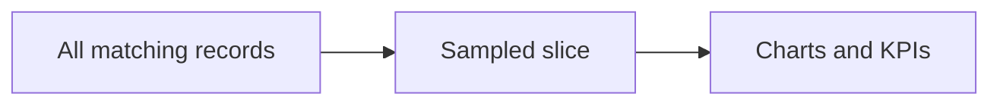

# Filters and scope

The filter bar at the top of the Traffic Analytics page constrains every KPI card and chart on the page. Sampling controls how much data the page loads.

## Filter Controls

| Control | Use it to |
| --- | --- |
| **Range** | Restrict to the last 24h, 7d, 30d, 90d, or everything loaded. |
| **Gateway** | Switch between **AI and MCP**, **AI only**, or **MCP only**. |
| **Entity** | Pick the dimension used for entity breakdowns: provider, model, team, user, API key, MCP tool, or MCP server. |
| **Entity value** | Restrict to one specific value of the selected entity. |
| **Status** | All, success, errors, or unknown only. |
| **Search** | Free-text match against request id, trace id, provider, model, principal, error code, MCP tool, or MCP server. |

Filter changes apply instantly — no extra load.

## Sampling

| Control | Use it to |
| --- | --- |
| **Max records** | Cap the number of records pulled. Useful on long ranges. |
| **Sample** | The percentage of available records sampled by the backend. Lower percentages mean a faster but coarser page. |

The KPI cards and the footer text always reflect the sampled slice, not the full population. When you need exact counts, use the [Usage Records analytics card](/docs/observability/usage-records/usage-analytics) instead.

## Refresh

The **Refresh** button on the filter card forces a reload with the current settings. The page shows an inline error message if the reload fails and keeps the last successful view on screen.

## Tips

<Callout type="tip">
Set **Entity** to **API Key** and pick a single key to baseline one application. The latency and error KPIs then reflect that key only — that is the fastest way to compare a key against itself after a deploy.
</Callout>

<Callout type="warning">
Sampling is non-deterministic — two viewers with the same filters may see slightly different rows. Use Usage Records when reproducibility matters.
</Callout>
