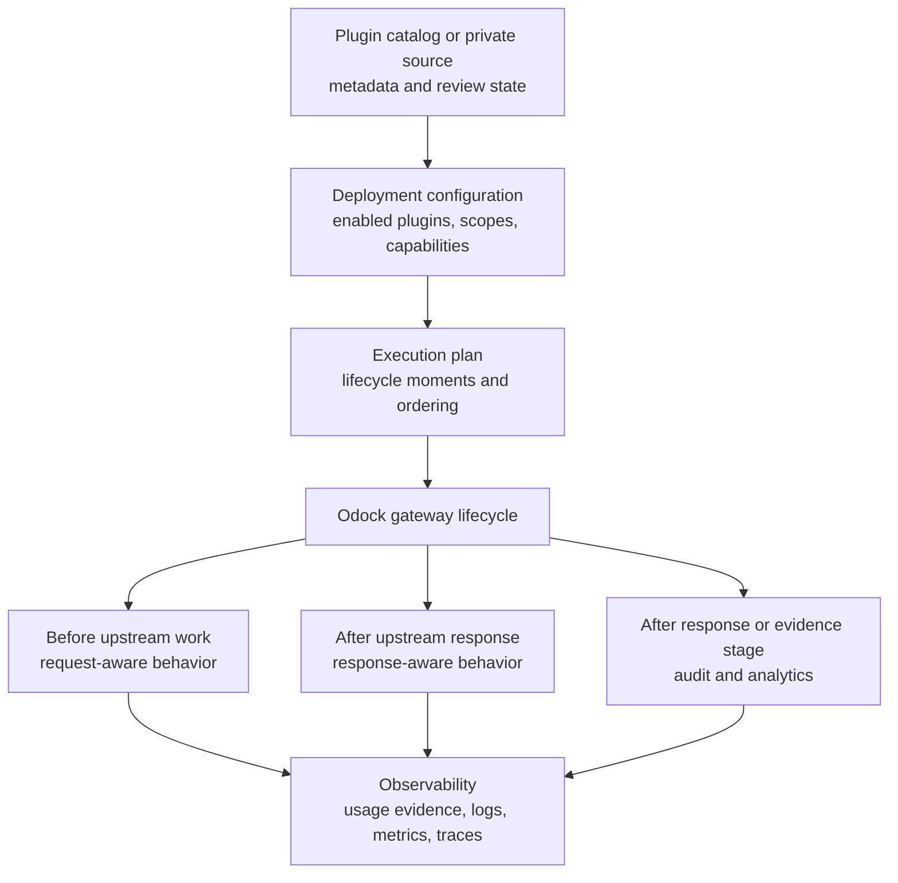

# Architecture

Odock plugins are governed modules that participate in selected gateway lifecycle gates. A gate is a point where Odock has enough context for a plugin to make a useful decision or record useful evidence.

This page describes the public operating model. It intentionally avoids private implementation contracts, source-code paths, storage wiring, queue internals, worker details, and admin-only secrets. If your deployment needs those details, contact the Odock team for the full implementation path.

## Public Architecture Model

The exact internal phase order is deployment-managed. The public rule is that a plugin runs only where its required context exists.

- A request enrichment plugin needs authenticated request and resource context.
- A response analytics plugin needs the upstream response.
- An audit export plugin may run after response handling so it does not delay the caller.
- A proprietary DLP plugin may need both request-aware and response-aware placement.

## What A Plugin Can Do

Depending on configuration and granted capabilities, a plugin may:

- inspect selected request metadata or content
- add request metadata, tags, or headers
- call an approved external service such as a DLP, SIEM, approval, email, or webhook endpoint
- transform selected request or response fields
- block with a stable user-visible reason
- emit operational evidence for Usage Monitoring, logs, metrics, traces, or audit export
- run background work that should not affect the caller response

Capabilities are intentionally scoped. A plugin should not receive broad storage access, unrestricted outbound network access, secret access, or response mutation permission unless the deployment explicitly requires it.

## Least Privilege

Least privilege is the core plugin safety model. Before enabling a plugin, review:

- which lifecycle moments it uses
- whether it can block, transform, or only observe
- which request or response fields it needs
- whether it sends data outside Odock
- which models, MCP servers, API keys, teams, or tenants it applies to
- what secrets or credentials it requires
- what evidence it produces for operators

The goal is to make plugin behavior understandable from the UI, logs, and usage evidence. A plugin should not hide enforcement that users need to understand.

## Plugin Gates

Plugin gates are placed where the plugin has the right context. Odock does not expose the full private runtime plan as public documentation because the plan can change by deployment, gateway version, and enabled feature set.

Publicly, you can reason about three broad moments:

| Moment | Context available | Common plugin work |
| --- | --- | --- |
| Before upstream work | Authenticated caller, selected resource, request metadata, and request content where available. | Request enrichment, tenant-specific checks, approval checks, DLP before egress, custom headers. |
| After upstream response | Upstream status, response metadata, response content where available, routing or provider outcome. | Response transformation, response DLP, policy evidence, analytics signals. |
| After response/evidence stage | Request id, outcome, usage evidence, cost or latency signals, plugin decisions. | Audit export, webhook delivery, email, analytics warehouse export, recommendation signals. |

For lifecycle details, see [Plugin Lifecycle](/docs/plugins/plugin-lifecycle).

## Ordered, Independent, And Background Work

Plugins are composed based on their impact.

| Work style | Use when | Operator expectation |
| --- | --- | --- |
| Ordered | A plugin mutates request or response state, depends on an earlier decision, or can block. | The order is reviewed during enablement and rollout. |
| Independent | Plugins observe or emit evidence without shared mutation. | Multiple plugins can contribute evidence for the same request. |
| Background | Work should happen after the response path, such as audit export or analytics. | The caller should not wait for non-blocking work unless the deployment requires it. |

The public guarantee is behavioral clarity: operators should know whether a plugin can affect the response path or only produce evidence.

## Observability

Plugin observability should answer four questions:

- What did the plugin see enough to decide?
- What did it do: allow, block, transform, record, emit, or fail?
- Which request id, API key, model, MCP server, team, tenant, or organisation was involved?
- Where can an operator inspect the outcome?

Use [Usage Monitoring](/docs/observability/usage-records) for request-level evidence. Use [LGTM Stack](/docs/observability/lgtm-stack) for logs, metrics, and traces where your deployment emits plugin telemetry.

## Relationship To Other Odock Sections

Plugins are part of the runtime governance layer, but they are not the only layer.

| Area | Relationship |
| --- | --- |
| [Security & Guardrails](/docs/security-and-guardrails) | Plugins can be plugin gates, but standard policy, access, and ratelimit behavior should stay in guardrails. |
| [SafetySec](/docs/security-and-guardrails/safetysec-engine) | SafetySec handles prompt and response safety. Plugins handle custom workflow and integrations. |
| [Models & MCP](/docs/models-and-mcp) | Plugins may use model or MCP context, but access grants still decide whether a key can call a resource. |
| [Virtual API Keys](/docs/management/virtual-api-keys) | Plugins use API key attribution to scope behavior and produce evidence. |
| [Budgets](/docs/management/budgets) and [Quotas](/docs/management/quotas) | Plugins can add evidence or integrations around cost and usage, but spend and usage ceilings belong in budgets and quotas. |
| [MCP Security](/docs/models-and-mcp/mcp-servers/security) | MCP tool governance remains first-class; plugins can add extra tenant or enterprise workflow around MCP traffic. |
