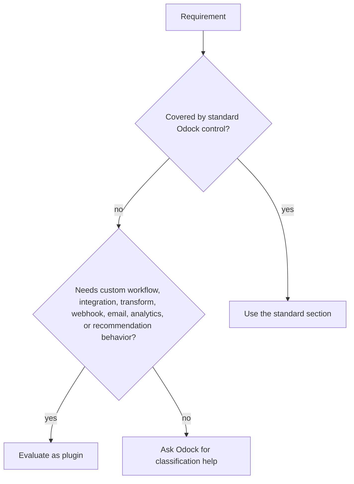
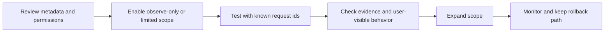

# Evaluate A Plugin

Evaluate a plugin before enabling it because plugins can participate in runtime enforcement, transformation, external integrations, and evidence collection.

Use this checklist for built-in, marketplace, private/internal, and custom-developed plugins.

## 1. Define The Requirement

Write the requirement in one sentence:

```txt
Use this plugin to <allow, block, transform, enrich, export, notify, or analyze> <traffic or evidence> for <scope>.
```

Examples:

| Requirement | Good plugin fit? |
| --- | --- |
| Export high-risk request decisions to the security team's SIEM. | Yes |
| Add tenant metadata to selected model calls. | Yes |
| Send an email when an enterprise approval is required. | Yes |
| Detect special words for product analytics and recommendations. | Yes |
| Limit requests per minute. | No, use guardrail policies. |
| Block prompt injection. | Usually no, use SafetySec. |
| Stop traffic after monthly spend is exceeded. | No, use budgets. |

## 2. Confirm It Belongs In Plugins



Use standard sections when possible:

- [Security & Guardrails](/docs/security-and-guardrails) for policy and runtime enforcement.
- [SafetySec](/docs/security-and-guardrails/safetysec-engine) for prompt and response safety.
- [Models & MCP](/docs/models-and-mcp) for model and MCP resource setup.
- [Virtual API Keys](/docs/management/virtual-api-keys) for authentication and access grants.
- [Budgets](/docs/management/budgets) and [Quotas](/docs/management/quotas) for cost and usage ceilings.

## 3. Review Lifecycle Moments

| Question | Why it matters |
| --- | --- |
| Does it run before upstream work? | It may affect what leaves Odock. |
| Does it run after upstream response? | It may affect what the caller receives. |
| Does it run after response/evidence? | It should usually be non-blocking audit, analytics, webhook, or email work. |
| Can it block? | Operators need a user-visible error reason and rollout plan. |
| Can it transform? | Operators need to know which fields can change. |

The plugin should run only where it has the right context. If a marketplace listing does not explain lifecycle placement clearly, do not enable it without review.

## 4. Review Capabilities

Confirm whether the plugin requires:

- request inspection
- response inspection
- request mutation
- response mutation
- external network calls
- webhook delivery
- email delivery
- secret or credential access
- background work
- model, MCP, API key, team, tenant, or organisation scope

Least privilege means granting only what the plugin needs for the approved requirement.

## 5. Review Data Handling

Ask:

- Does any prompt, response, metadata, header, token count, cost, or user identifier leave Odock?
- Which external system receives it?
- Is the payload minimized?
- Is sensitive data redacted or classified before export?
- Are data residency, retention, and vendor requirements acceptable?
- Does the plugin support an observe-only or dry-run mode?

For MCP traffic, also review [MCP Security](/docs/models-and-mcp/mcp-servers/security), because tool calls can carry operational data or trigger side effects.

## 6. Review Observability

A plugin should produce enough evidence to operate it:

| Evidence | Use |
| --- | --- |
| Request id | Correlate plugin behavior with gateway usage. |
| Decision | See whether the plugin allowed, blocked, transformed, emitted, or failed. |
| Scope | Know which organisation, team, API key, model, MCP server, or tenant was affected. |
| External delivery id | Reconcile webhook, email, SIEM, DLP, or analytics exports. |
| Error and retry state | Distinguish plugin failure from intended enforcement. |
| Timing | Understand latency added by response-path plugins. |

For current custom plugin delivery, use [Request A Custom Plugin](/docs/plugins/request-custom-plugin). For the planned self-service marketplace model, see [Marketplace](/docs/plugins/marketplace).

## 7. Plan Rollout



Start narrow:

- one test API key
- one team
- one tenant
- one model or MCP server
- observe-only before block, when available
- non-production before production for high-impact plugins

## Enablement Checklist

Before enabling, confirm:

- purpose and owner are clear
- plugin type is understood
- lifecycle moments are appropriate
- required capabilities are acceptable
- data handling is approved
- configuration values are ready
- compatibility is confirmed
- user-visible behavior is documented
- observability is sufficient
- rollout scope and rollback criteria are defined
- Odock assistance is requested if private implementation details are needed
