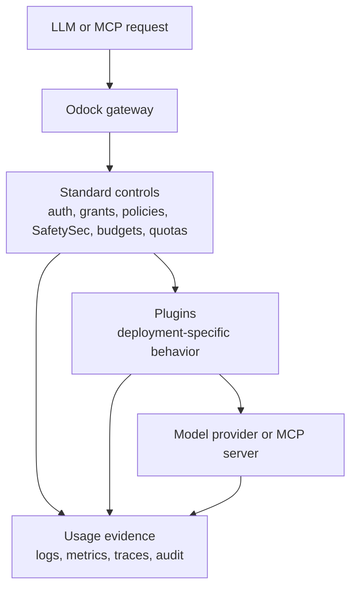

# Plugins

Plugins are modular extension points in the Odock gateway lifecycle. They let an Odock deployment add custom checks, transformations, integrations, and evidence collection around LLM and MCP traffic without changing how applications call the gateway.

Use plugins when the behavior is specific to your organisation, tenant, workflow, or downstream toolchain. Examples include audit export, request enrichment, tenant-specific checks, custom approval workflows, proprietary DLP integrations, custom headers, enterprise policy integrations, post-response analytics, webhooks, email notifications, and recommendation workflows that depend on conversation context.

Plugins are powerful because they sit near runtime traffic. They are governed because they must be scoped, observable, explicitly enabled, and placed only where they have the right context.

## Why Plugins Exist

Odock already has first-class controls for common AI governance problems:

- [Virtual API Keys](/docs/management/virtual-api-keys) authenticate callers and provide runtime attribution.
- [Models & MCP](/docs/models-and-mcp) define the resources applications can call.
- [Security & Guardrails](/docs/security-and-guardrails) enforce policy limits, access, request limits, MCP rules, SafetySec, and cost boundaries.
- [Budgets](/docs/management/budgets) and [Quotas](/docs/management/quotas) enforce spend and usage ceilings.
- [Usage Monitoring](/docs/observability/usage-records) records what happened.

Plugins exist for the work that is too deployment-specific to become a universal product control. They are where Odock can integrate with your internal approval system, your SIEM, your DLP provider, your data classification service, your email workflow, your analytics warehouse, or your own business logic.

## What Plugins Are

A plugin is a named unit of behavior that can participate at one or more moments in the gateway lifecycle. Depending on its purpose and permissions, a plugin may:

- allow traffic to continue
- block traffic with a user-visible reason
- transform allowed request or response fields
- add metadata or headers
- call an external system through a governed integration
- emit audit, analytics, or operational evidence
- run follow-up work after the caller has received the response

A plugin is not a general escape hatch around Odock governance. It should be designed with least privilege, explicit deployment configuration, stable audit evidence, and clear user-visible behavior.

## When To Use Plugins

Use a plugin when the requirement is business-specific, integration-specific, or workflow-specific.

| Need | Use |
| --- | --- |
| Export selected request decisions to a SIEM or audit archive. | Plugin |
| Add tenant metadata, trace headers, or custom billing tags before upstream work. | Plugin |
| Consult an enterprise approval system for sensitive model use. | Plugin |
| Send webhooks, email, or analytics events after a response. | Plugin |
| Recommend an internal offer or workflow based on conversation signals. | Plugin |
| Enforce requests per minute, request bytes, token windows, or concurrency. | Guardrail policy or ratelimit module |
| Detect prompt injection, unsafe output, leakage, or redaction needs. | [SafetySec](/docs/security-and-guardrails/safetysec-engine) |
| Decide whether an API key can call a model or MCP server. | Access grant |
| Stop spend or usage after a period limit is reached. | Budget or quota |

## How Plugins Differ From Other Controls

Plugins often work next to guardrails, SafetySec, budgets, quotas, and access grants, but they do not replace them.

| Control | Primary question | Typical owner |
| --- | --- | --- |
| Access grants | Can this virtual API key call this model or MCP server? | Operator |
| Guardrail policies | Does this traffic satisfy configured runtime limits? | Operator |
| Ratelimit modules | Is the traffic shape acceptable right now? | Odock runtime policy |
| SafetySec modules | Is the prompt or response safe according to security rules? | Security operator |
| Budgets | Would this exceed a spend boundary? | Finance or platform operator |
| Quotas | Would this exceed a usage boundary? | Platform operator |
| Plugins | Does this deployment need custom workflow, integration, transformation, or evidence? | Deployment owner with Odock review |

For the broader security model, start with [Security & Guardrails](/docs/security-and-guardrails). For prompt and response safety, see [SafetySec](/docs/security-and-guardrails/safetysec-engine). For MCP-specific tool risk, see [MCP Security](/docs/models-and-mcp/mcp-servers/security).

## Plugin Design Philosophy

Odock plugin design follows six principles.

| Principle | Meaning |
| --- | --- |
| Modularity | A plugin should solve one clear problem and be replaceable without changing application code. |
| Least privilege | A plugin should receive only the capabilities, lifecycle moments, and data it needs. |
| Lifecycle placement | A plugin should run where the required context exists, not earlier. |
| Composability | Multiple plugins should be able to contribute independent decisions or evidence without becoming one large custom subsystem. |
| Observability | Operators should understand what the plugin allowed, blocked, transformed, emitted, or recorded. |
| Deployment-specific behavior | Plugins can express behavior that belongs to a customer, tenant, environment, vendor, or private integration. |

When a plugin requires internal implementation details, custom contracts, private deployment setup, or a security review, contact the Odock team. Public documentation explains the operating model, not private gateway wiring.

## Section Guide

- [Architecture](/docs/plugins/architecture): public-safe architecture, lifecycle gates, least privilege, and observability.
- [Plugin Lifecycle](/docs/plugins/plugin-lifecycle): how plugins participate before upstream work, after upstream response, and after response or evidence collection.
- [Marketplace](/docs/plugins/marketplace): coming-soon marketplace concept for discovering, publishing, selling, reviewing, and enabling plugins.
- [Evaluate A Plugin](/docs/plugins/evaluate-plugin): checklist for deciding whether to enable a plugin.
- [Request A Custom Plugin](/docs/plugins/request-custom-plugin): current public-safe process for requesting custom plugin work from Odock.
